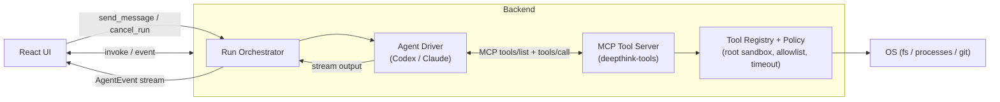
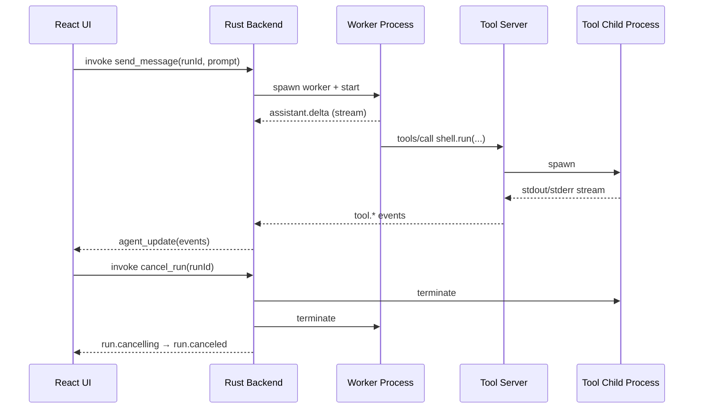

프론트엔드와 AI 에이전트 사이에서 든든한 브릿지 역할을 수행할 **백엔드(BE) 설계 문서**입니다. 이 문서는 에이전트의 지능보다는 시스템의 '안정성, 병렬 처리 능력, 그리고 표준화된 통신'에 초점을 맞추고 있습니다.

---

# 데스크탑 AI 채팅 앱 백엔드 (BE) 설계 문서

## 1. 개요 및 기술 스택

이 백엔드는 Tauri 프레임워크 기반의 Rust 환경에서 동작하며, 로컬 CLI 에이전트(Codex, Claude Code)의 실행 상태를 관리하고 프론트엔드와 통신하는 **MCP(Model Context Protocol) 기반 Tool 서버이자 오케스트레이터**입니다.

- **코어 언어:** Rust
    
- **데스크탑 프레임워크:** Tauri
    
- **비동기 런타임:** Tokio (프로세스 I/O 스트림 및 병렬 스레드 관리)
    
- **직렬화/통신:** `serde`, `serde_json` (JSON-RPC 및 MCP 규격 파싱)
    
- **에러 처리:** `anyhow`, `thiserror` (프로세스 및 파싱 에러 추적)
    

## 2. 핵심 모듈 및 아키텍처

이 프로젝트의 핵심 결정은 **"에이전트(LLM 실행기)와 도구 실행을 분리"**하는 것입니다.

- Codex/Claude Code는 "추론/결정/도구 호출"만 수행합니다.
- 실제 파일/쉘/Git 작업은 Rust 백엔드가 제공하는 **기본 제공 Tool**로만 수행합니다.
- 프론트엔드는 Rust가 발행하는 **Execution Trace 이벤트**로 Thought Tree를 구성합니다. (모델 텍스트 파싱 금지)

### A. 에이전트 프로세스 매니저 (`Agent Runner / Driver`)

Codex, Claude Code를 **워커 프로세스**로 실행하고, 출력 스트림을 파싱해 이벤트로 정규화합니다.

- **비동기 실행:** `tokio::process::Command`로 워커를 Non-blocking 실행합니다.
- **stdout/stderr 드레이닝:** 버퍼가 차서 멈추는 문제를 막기 위해 둘 다 지속적으로 비웁니다.
- **스트리밍 파싱:** 가능하면 CLI가 제공하는 JSON 스트리밍 포맷(JSONL/stream-json 등)을 사용하고, 불가하면 최소한 라인 프레이밍을 강제합니다.
- **Graceful Shutdown:** 앱 종료/Cancel 시 워커를 안전하게 종료(TERM→KILL)합니다.

### B. 기본 제공 Tool 서버 (`DeepThink Tools MCP Server`)

v1에서는 백엔드가 다음 Tool을 **표준 인터페이스(MCP)** 로 제공합니다. 워커는 이 Tool만 사용할 수 있고, 백엔드가 정책을 집행합니다.

- **fs**
  - `fs.read` / `fs.list` / `fs.search`
  - `fs.apply_patch` (쓰기 작업의 기본 경로)
- **shell**
  - `shell.run` (allowlist + timeout + streaming)
  - `shell.cancel` (진행 중인 실행 중단)
- **git** (선택: v1 포함 권장)
  - `git.status` / `git.diff` / `git.log` (또는 `shell.run` allowlist로 대체)

**Project Root Sandbox (v1 필수):**
- 모든 경로/작업은 **프로젝트 루트 하위로만 제한**합니다. (경로 탈출 및 symlink escape 차단)
- `shell.run`은 `cwd=projectRoot` 고정 + 명령 allowlist/timeout/output cap으로 제한합니다. (위험/네트워크 계열 기본 금지)

### C. 이벤트 정규화 & 라우팅 (`Event Normalizer`)

프론트엔드는 모델의 원문(Chain-of-thought)을 파싱하지 않고, 백엔드가 발행하는 이벤트 스트림만 소비합니다.

**권장 이벤트 최소 필드:**
- `runId`, `workerId`
- `seq` (run 단위 단조 증가; 중복/역순 수신에도 idempotent 적용)
- `type` (assistant stream / tool lifecycle / run state 등)
- `payload` (type별 데이터)

Tool 실행은 “시작 → (출력/진행)* → 종료”로 이벤트를 분리하여, UI가 안정적으로 상태를 재구성할 수 있게 합니다.

### D. 병렬 에이전트 오케스트레이션 (`Multi-Agent Orchestrator`)

Deep Think는 "Run(질문 1회)" 안에서 다수 워커를 병렬로 돌리고, 마지막에 Judge가 병합합니다.

- **Run/Worker 모델:** `runId` 아래 `workerId`(A/B/C…)를 고정하고, 워커별 이벤트를 분리해 수집합니다.
- **Actor 권장:** 공유 락을 크게 잡기보다, 워커별 Task(Actor)로 상태를 캡슐화하면 데드락을 피하고 수명이 명확해집니다.
- **Judge 단계:** 워커 결과(요약 + 증거 + 실패 원인)를 모아 Judge 워커에 전달해 최종 요약/병합을 생성합니다.

### E. Cancel / 타임아웃 / 예산 (`Cancellation & Budgeting`)

v1 Cancel은 “프로토콜 지원 여부”와 무관하게 **OS 레벨 중단**을 기본으로 둡니다.

- `cancel_run(runId)` → 해당 run의 모든 워커/하위 작업을 중단(graceful terminate → force kill) → 상태를 `cancelling`→`canceled`로 확정 이벤트 발행
- Tool 실행도 함께 중단할 수 있도록 추적합니다.
- Tool별 timeout을 기본 제공하고, timeout 시 정리 이벤트를 남깁니다.

### F. Tauri IPC 인터페이스 (`Event Broadcaster`)

Rust 백엔드에서 정제된 상태와 데이터를 프론트엔드(React)로 밀어 넣습니다.

- **명령 수신 (Commands):** 프론트엔드에서 호출하는 `invoke` 명령(예: `send_message`, `cancel_run`)을 run/worker 실행 요청으로 변환하고, 워커 프로세스를 시작하거나 Cancel을 트리거합니다.
    
- **상태 브로드캐스팅 (Events):** 백엔드에서 에이전트의 상태 변화(생각 중, 도구 실행 중, 스트리밍 토큰 생성)가 감지되면, 즉시 `app_handle.emit_all("agent_update", payload)`를 통해 프론트엔드로 이벤트를 발송(Push)합니다.
    

## 3. 데이터 및 제어 흐름 (Data Flow)

1. **[사용자 입력]** React UI에서 질문 작성 후 전송.
    
2. **[Tauri Command]** Rust 백엔드가 `invoke`를 통해 메시지 수신.
    
3. **[오케스트레이션]** Rust가 run을 만들고 여러 워커 프로세스를 병렬로 실행.
    
4. **[도구 호출]** 워커는 필요 시 MCP Tool Server로 `tools/call`을 수행(파일 읽기, 테스트 실행 등).
    
5. **[비동기 수신]** 워커 출력 스트림 + Tool 이벤트를 수신하여 `AgentEvent`로 정규화.
    
6. **[Tauri Event]** `emit_all`을 통해 프론트엔드로 상태 즉각 푸시.
    
7. **[UI 업데이트]** 프론트(Jotai)가 이벤트를 구독하여 Thought Tree/Terminal/Worker 탭을 렌더링.
    

## 4. 안정성 및 에러 핸들링

- **데드락 방지:** 프로세스의 `stdout`과 `stderr` 버퍼가 꽉 차서 애플리케이션이 멈추는 것을 방지하기 위해 버퍼 비우기를 철저히 관리합니다.
    
- **실행 권한 샌드박싱 (v1 필수):** Tool 실행은 반드시 프로젝트 루트 기준으로 제한하며, `shell.run`은 allowlist/timeout/output cap을 둡니다.
- **백프레셔:** 이벤트 폭주 시 UI 프레임 드랍을 막기 위해, `tool.stdout`는 라인 단위로 배치하거나(예: 16ms/50ms) 길이를 제한(truncation)합니다.
    

---

이제 인프라를 담당하는 BE 문서까지 완성되었습니다. 백엔드가 이 구조대로 구축된다면, 그 위에서 에이전트들이 마음껏 날뛸 수 있을 것입니다.

이 문서 기준으로 다음 구현 단계에서는 **Tool 서버 + 이벤트 스키마 + Cancel**을 먼저 고정하면, FE/UI는 안정적으로 따라올 수 있습니다.
