작성된 자바스크립트에서 시작한다. 자바스크립트 엔진은 소스코드를 파싱하고 이를 Abstract Syntax Tree(AST)로 변환한다. AST에 기반해서 인터프리터는 바이트코드를 생성한다. 그리고 이 시점에 자바스크립트 코드가 실행된다.

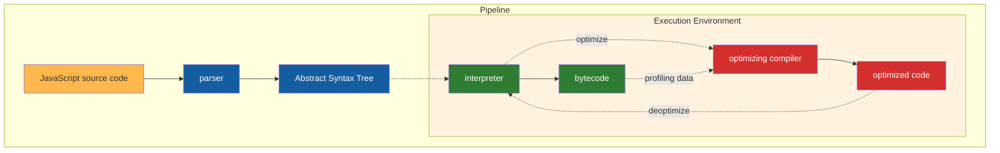

빠르게 동작하게 하기 위해서, 바이트코드는 최적화 컴파일러에 프로파일링 데이터와 함께 전달될 수 있다. 최적화 컴파일러는 전달받은 프로파일링 데이터를 사용해 **특정 가정**을 하고, 최적화된 기계어를 생성한다.

> [! Note] 특정 가정이란?
> V8엔진의 최적화 컴파일러가 만드는 가정들은 코드가 어떻게 동작할지에 대한 예측과 관련이 있다.
> 
> 다음의 코드가 있다.
> 
> ```javascript
> function add(a, b) {
> 	return a + b;
> }
> 
> add(1, 2);
> add(3, 4);
> add(5, 6);
> ```
> 
> 이를 바탕으로 V8은 이 함수는 앞으로도 숫자만 처리할것이다 라는 가정을 한다. 이 가정을 바탕으로 최적화된 기계어 코드를 생성하는데, 이 코드는 타입 검사 같은 불필요한 과정을 생략하고 숫자 덧셈만 하도록 최적화된다.
> 
> 근데 만약 나중에 다음과 같이 실행된다면:
> ```javascript
> add("Hello", "World");
> ```
> 
> 가정이 깨지게 된다. 최적화된 코드를 더 이상 사용할 수 없다고 판단하고, 인터프리터 모드로 전환환다.

만약 특정 가정이 정확하지 않다고 판단되면, 최적화를 해제하고 인터프리터로 돌아간다.

## 자바스크립트 엔진의 인터프리터 / 컴파일러 파이프라인

자바스크립트 코드를 실제로 실행시키는 부분의 파이프라인을 확대해보자, 주요 자바스크립트 엔진들 사이의 차이점을 확인해보자.

일반적으로, 파이프라인에는 인터프리터와 최적화 컴파일러가 포함되어 있다. 인터프리터는 최적화되지 않은 바이트코드를 빠르게 생성하고, 최적화 컴파일러는 시간이 조금 더 걸리지만 결국 고도로 최적화된 기계어 코드를 생성한다.

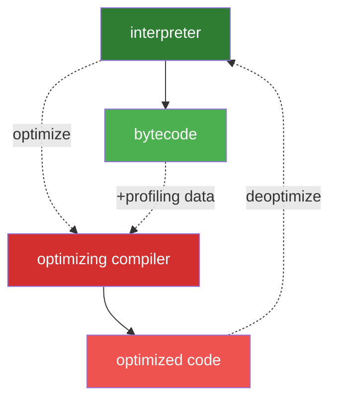

이러한 일반적인 파이프라인은 크롬과 Node에서 사용하는 V8이 작동하는 방식과 거의 일치한다.

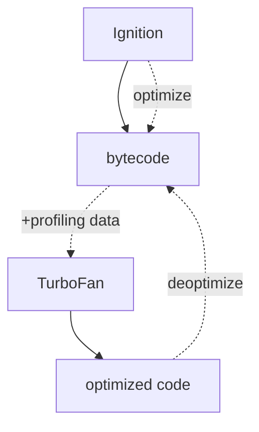

인터프리터는 V8에서 Ignition이라고 불리며, 바이트코드를 생성하고 실행하는 역할을 맡고 있다. 바이트코드를 실행하는 동안, 프로파일링 데이터를 수집한다. 어떤 특정 함수가 자주 사용된다면 바이트 코드가 생성되고 프로파일링 데이터와 함께 TurboFan(컴파일러)에 보내게 된다.

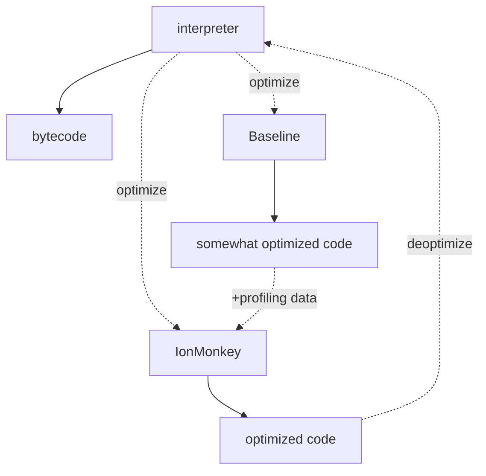

모질라의 자바스크립트 엔진인 `SpiderMonkey`에서는 조금 다르게 동작한다. `SpiderMonkey`는 두개의 최적화 컴파일러를 가지고 있다. 베이스라인 최적화 컴파일러를 사용해서 일단 적당히 최적화된 코드를 생성한다. 코드를 실행시키며 프로파일링 데이터와 함께 병합시키면, `IonMonkey` 컴파일러는 고도화된 최적화 코드를 생성한다. `IonMonkey`의 최적화가 실패하면 이전 적당히 최적화된 코드로 되돌린다.

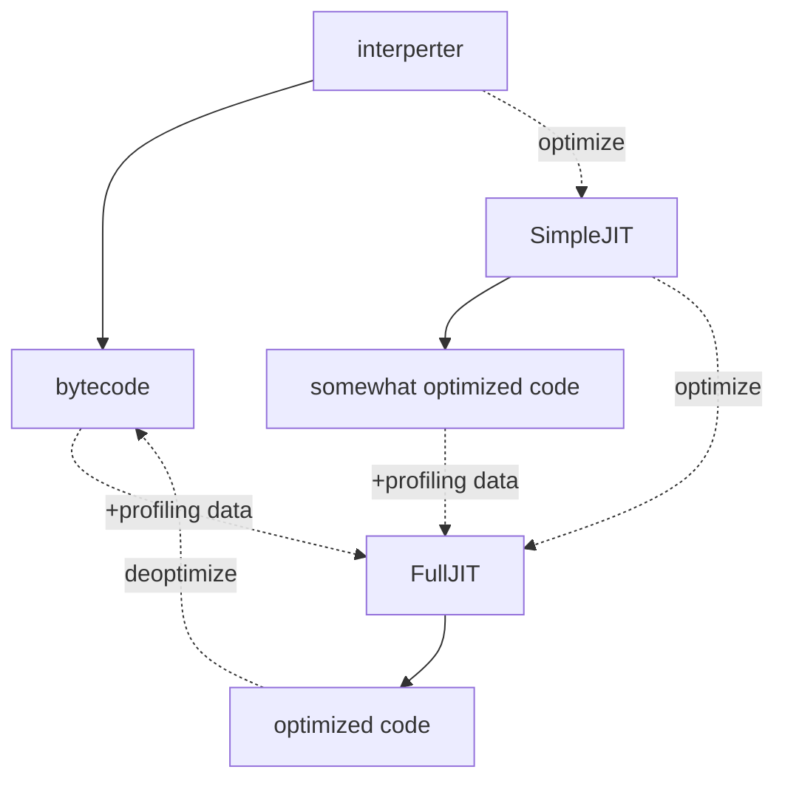

엣지의 자바스크립트 엔진인 Chakra도 유사하게 동작한다. 인터프리터가 SimpleJIT를 사용해 적당히 최적화된 코드를 생성한다. 이후 프로파일링된 데이터와 통합해서 더 높은 수준으로 최적화된 코드를 생성한다.

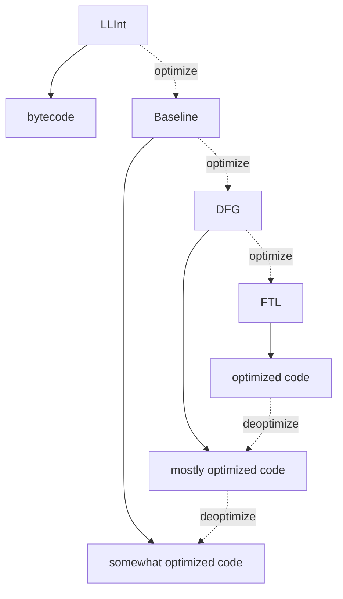

사파리와 ReactNative에서 사용되는, JSC라 불리는 JavaScripCore는 3가지 다른 최적화 컴파일러를 사용해 극대화한다. LLInt(Low-Level Interpreter) -> Baseline -> DFG -> FTL의 파이프라인을 통해 최적화된 코드를 생성한다.

엔진들이 최적화 컴파일러를 이렇게 많이 사용하는 이유는 뭘까? 인터프리터는 바이트코드를 생성할 수 있지만, 이 바이트 코드는 그렇게 효율적이지 않다. 최적화 컴파일러는 효율적인 기계어를 생성할 수 있지만 이 과정이 오래걸린다. 그렇기에 인터프리터를 통해 생성된 바이트코드로 빠르게 실행하고, 그 동안 최적화 컴파일러를 사용해 최적화된 코드를 생성하고 실행시킨다.

이렇게 각자의 엔진마다 조금의 차이점이 있지만, 결국 고수준에서 보면 같은 아키텍처를 가진다: **파서(parser)와 인터프리터/컴파일러의 조합**

## 자바스크립트 Object 모델

자바스크립트 엔진들이 특정 기능들을 어떻게 구현하는지 자세히 보면서, 엔진들이 공통적으로 가지고 있는 다른 특징들도 알압자.

JavaScript엔진들은 객체 모델을 어떻게 구현하고, 객체의 속성에 접근하는 속도를 높이기 위해 어떤 기법들을 사용할까? 거의 모든 주요 엔진들이 비슷한 방식의 구현체를 가진다.

```js
object = {
	x: 5,
	y: 6,
};
```

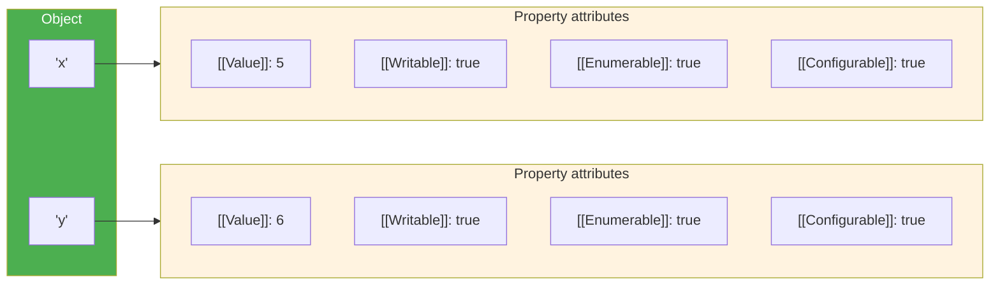

`[[Value]]`를 제외하고 명세는 이 프로퍼티들을 다음과 같이 정의한다:
- `[[Writable]]`: 프로퍼티가 재할당 될 수 있는지에 대한 속성이다.
- `[[Enumerable]]`: `for-in`루프에서 이 프로퍼티가 방문되는지에 대한 속성이다.
- `[[Configurable]]`: 프로퍼티가 삭제될 수 있는지에 대한 속성이다.

`[[double square brackets]]`는 이상하게 보이지만, 자바스크립트 코드로 노출하지 않고 각  프로퍼티의 명세를 기술하는 방법이다. 물론 `Object.getOwnPropertyDescriptor` API를 사용해서 자바스크립트로 접근할수도 있다.

```js
const object = { foo: 42 };
Object.getOwnPropertyDescriptor(object, 'foo');
// -> { value: 42, writable: true, enumerable: true, configurable: true }
```

이게 자바스크립트가 객체를 정의하는 방식이다. 배열을 어떨까?

배열은 객체의 특이 케이스로 생각할 수 있다. 하나의 다른점은 배열 인덱스를 다루는 특별한 방법을 가진다는 것이다. ECMAScript 명세에서 배열 인덱스는 특별한 용어다.

자바스크립트에서 배열은 2^32 - 1로 제한된다. 0 ~ 2^32 - 2의 범위안에 있는 정수라면 모두 유효하다.

다른 차이점은 배열은 `length`라는 프로퍼티를 가진다는 점이다.

```js
const array = ['a', 'b'];
array.length; // -> 2
array[2] = 'c';
array.length; // -> 3
```

자바스크립트는 배열을 객체와 유사하게 정의한다. 예를들어, 배열 인덱스를 포함한 모든 키는 명시적으로 문자열로 표현된다. 배열의 첫 번재 요소는 `'0'`이라는 키로 저장된다.

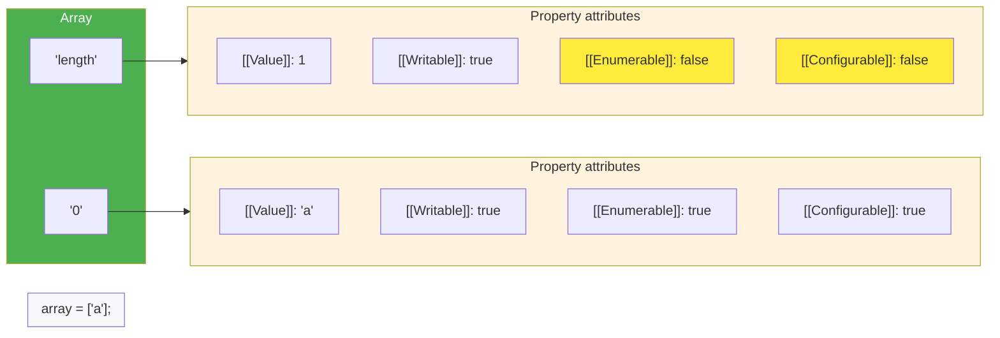

`length` 프로퍼티는 `non-enumerable`, `non-configurable`한 설정을 가진다. 즉, 삭제될 수 없고, 순회할 수 없는 요소다.

배열에 요소가 주가되면, 자바스크립트는 자동적으로 `length`의 `[[Value]]` 프로퍼티 값을 업데이트한다.

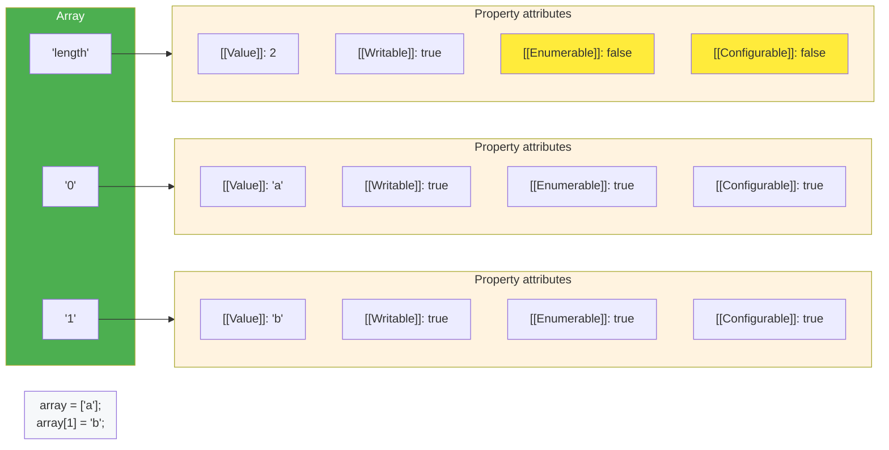

이처럼 배열은 객체와 유사하게 동작한다.

## 프로퍼티 접근 최적화

이제 자바스크립트에서 객체가 어떻게 정의되는지 알고있다. 자바스크립트 엔진이 객체를 어떻게 효율적으로 다루는지에 대해 알아보자.

자바스크립트로 개발을 하다보면 객체의 프로퍼티에 접근하는 연산은 자주 발생한다. 자바스크립트 엔진에서 프로퍼티 접근을 빠르게 하는 일은 중요하다.

```js
const object = {
	foo: 'bar',
	bas: 'qux',
};

// 'foo'에 대한 접근
doSomething(object.foo);
```

### Shapes(형태)

자바스크립트에서 같은 프로퍼티 키들을 가지는 객체가 생성되는 일은 흔하다. 이 객체들은 같은 형태를 가진다.

```js
const object1 = { x: 1, y: 2 };
const object2 = { x: 3, y: 4 };
```

그리고 같은 형태를 가지는 객체에서 같은 프로퍼티에 접근하는 일도 흔한 일이다.

```js
function logX(object) {
	console.log(object.x);
}

const object1 = { x: 1, y: 2 };
const object2 = { x: 3, y: 4 };

logX(objexc1);
logX(object2);
```

자바스크립트 엔진은 이 객체의 형태를 사용해 프로퍼티 접근을 최적화할 수 있다.

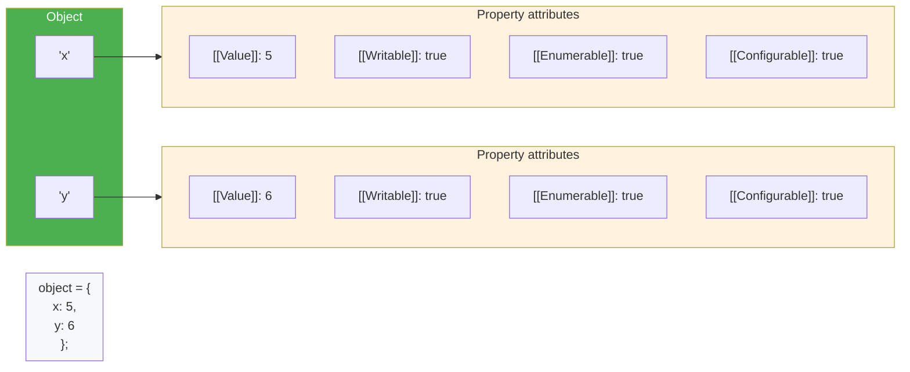

예를 들어 `objecty.y`와 같이 속성에 접근할 때, JavaScript 엔진은 `JSObject`에서 `'y'`키를 찾고, 해당하는 속성 어트리뷰트를 불러온 다음, 마지막으로 `[[Value]]`를 반환한다.

이 속성들은 메모리 어디에 저장될까? 이것들을 전부 `JSObject`의 일부로 저장해야할까? 만약 나중에 이와 같은 형태의 객체들을 더 많이 보게 될 것이라고 가정한다면, 속성 이름들과 어트리뷰트들을 포함하는 전체 딕셔너리를 `JSObject`에 저장하는 것은 낭비다. 같은 형태를 가진 모든 객체들에 대해 속성 이름들이 반복되기 때문이다. 이는 많은 중복과 불필요한 메로리 사용을 초래한다. 최적화를 위해 엔진들은 객체의 `Shape`를 별도로 저장한다.

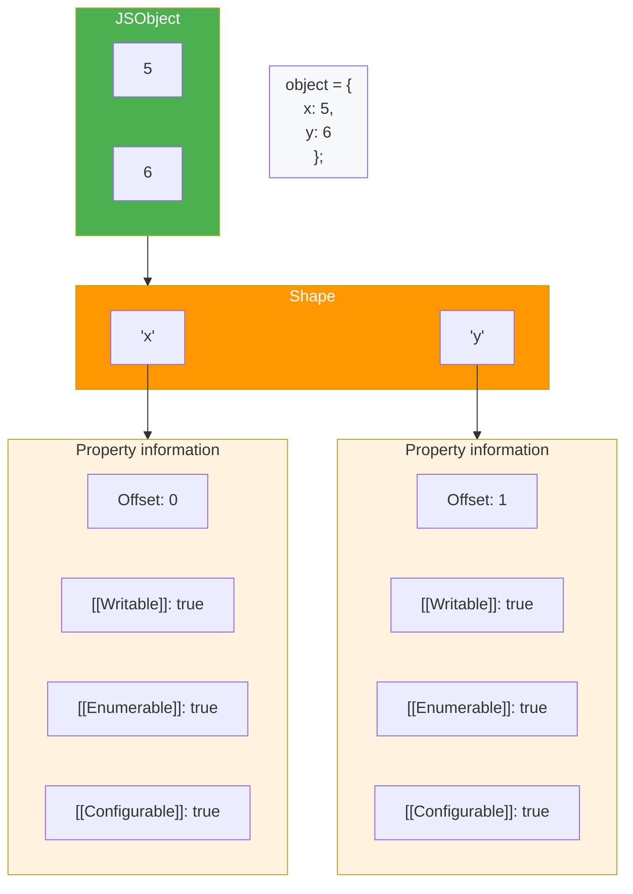

이 `Shape`는 `[[Value]]`를 제외한 모든 프로퍼티 이름과 어트리뷰트를 가지고 있다. 대신 프로퍼티의 오프셋을 포함하고 있다. 이를 통해 자바스크립트 엔진은 어디서 `JSObject`의 프로퍼티 값을 찾아야 하는지 알 수 있다. 같은 형태를 가지는 `JSObject`들은 이 `Shape` 인스턴스를 가리킨다. 이제 모든 `JSObject`는 값만 저장하면 된다.

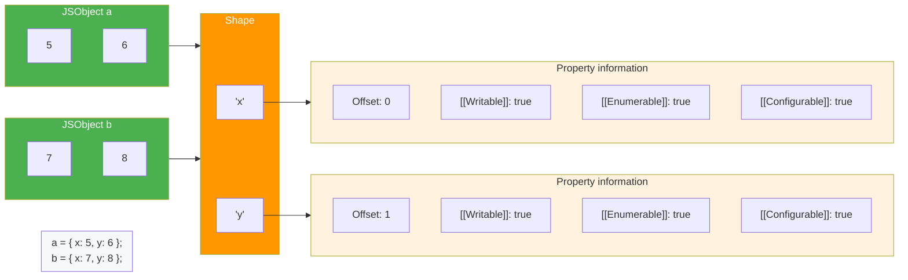

같은 형태의 여러 객체들을 가지게 되면 이에 대한 이점이 나타난다. 같은 형태의 객체들이 있다면 얼마나 많은 객체가 생성되든, 형태와 프로퍼티에 대한 정보를 한 번만 저장하면 된다.

모든 자바스크립트 엔진을은 이 최적화 방법을 사용한다:
- 학술적 자료에서는 이를 Hidden Class라고 부른다.
- V8에서는 이를 Maps라고 부른다.
- 차크라는 이를 Types라고 부른다.
- JavaScriptCore는 이를 Structures라고 부른다.
- SpiderMonkye는 이를 Shapes라고 부른다.

이 글에서는 shapes(형태)라고 부른다.

### Transition chains and trees

어떤 특정한 형태를 가지는 객체에 프로퍼티를 추가하는 경우는 어떻게 될까?

```js
const object = {};
object.x = 5;
object.y = 6;
```

자바스크립트 엔진에서 전이 체인(transition chains)을 형성한다:

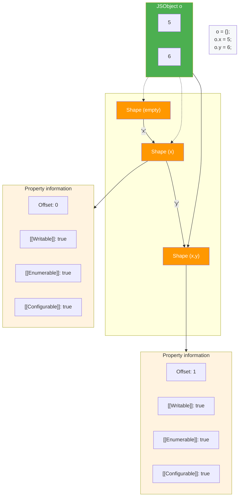

객체는 어떠한 프로퍼티도 없이 시작한다, 그렇기에 빈 형태를 가리킨다. 다음 상태에서 `'x'` 프로퍼티가 추가된다. 그러면 자바스크립트 엔진은 `'x'`를 포함하는 형태로 전이하고 `5`를 `JSObject`에 추가한다. 이후 `'y'` 값이 추가된다. 그러면 엔진은 또 다른 형태 `'x'`와 `'y'`를 포함하는 형태로 전이를 하고 `JSObject`에 `6`의 값을 추가한다.

> [!Note] 순서는 중요하다
> 다른 순서로 `'x'`와 `'y'`를 추가하게 되면, 다른 형태를 생성하게 된다.

이렇게 하면 각 `Shape`의 모든 프로퍼티에 대한 정보를 모을 필요가 없고, 어떤 프로퍼티가 추가되고 있는지만 추적할 수 있으면 된다. 아래 예제의 경우 마지막 형태에서 `'x'`에 대한 정보를 저장할 필요가 없다. 체인의 앞 부분에서 그 정보를 찾을 수 있기 때문이다. 이를 위해 모든 형태들은 양방향으로 연결되어 있다.

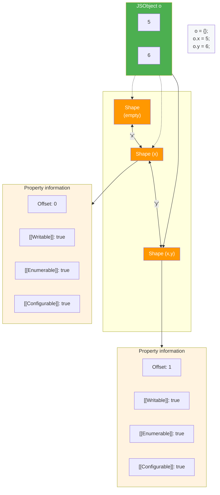


객체 리터럴 표기법을 통해 프로퍼티 값이 선언과 동시에 초기화 되는 경우 빈 상태를 생성하는 것을 피할 수 있다.

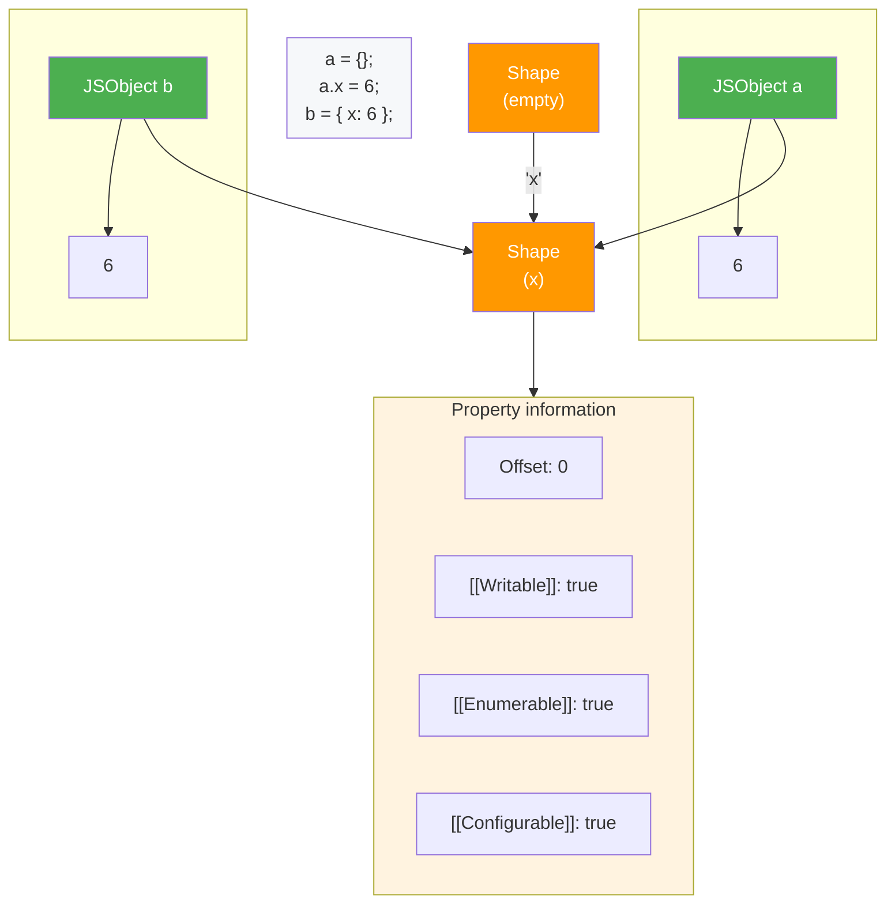

```js
const point = {};
point.x = 4;
point.y = 5;
point.z = 6;
```

이전에 얘기했듯이, 위 코드는 3개의 형태를 생성하게 된다. `'x'` 프로퍼티에 접근하기 위해서 자바스크립트는 형태 연결 리스트의 위에서부터 아래로 내려가며 `'x'`에 대한 정보를 가진 형태를 찾아가야 한다.

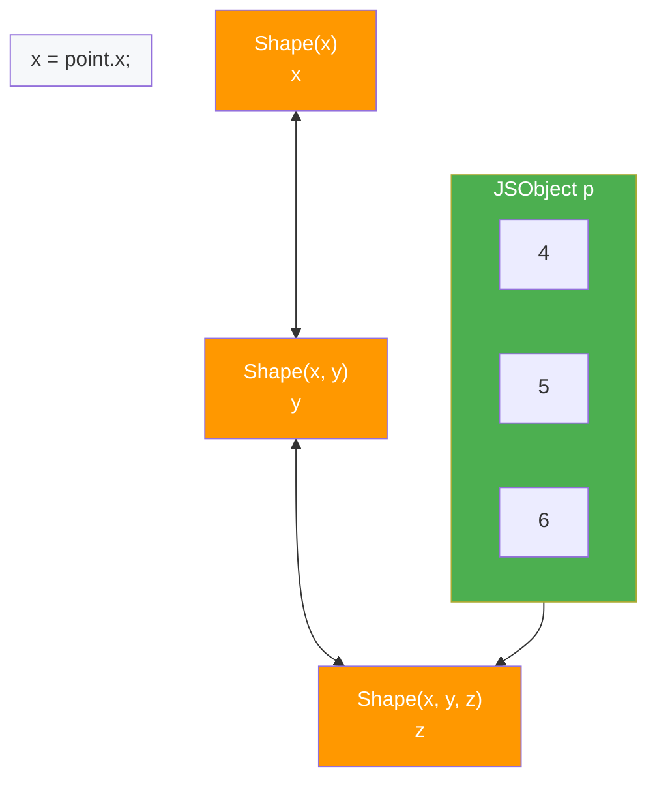

이는 굉장히 느린 동작이다. 프로퍼티를 찾는데 들어가는 시간 복잡도가 `O(n)`이기 때문이다. 이 속도를 높이기 위해 자바스크립트 엔진들은 `ShapeTable`이라는 데이터 구조를 추가했다. 이 `ShapeTable`은 딕셔너리이며, 프로퍼티 키와 이에 해당하는 `Shape`의 매핑을 가지고 있다.

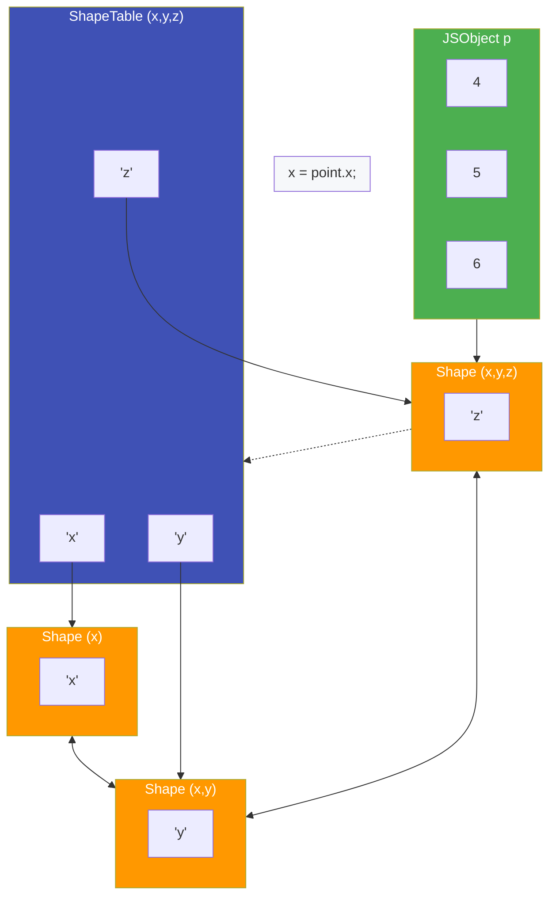

## 인라인 캐싱 (Inline Caches)

형태는 인라인 캐싱을 위해 제안되었다. 인라인 캐싱은 자바스크립트를 빠르게 할 수 있는 중요한 최적화 방법이다. 자바스크립트 엔진은 객체의 프로퍼티를 어디서 찾아야 하는지에 대한 정보를 저장하기 위해 인라인 캐싱을 사용한다.

다음과 같은 `getX` 함수가 있다:

```js
function getX(o) {
	return o.x;
}
```

`JSC(JavaScriptComfilor)`에서 이 함수를 실행시키면 다음의 바이트코드를 생성한다:

![[Excalidraw/Drawing 2024-12-09 11.50.48.excalidraw.md#^group=oamJpglHGHatJvPYWSOAZ]]

첫번째 `get_by_id` 명령어는 첫 번째 인자(`arg1`)에서 `'x'` 속성을 로드하여 그 결과를 `loc0`에 저장한다. 두 번째 병령어는 `loc0`에 저장된 값을 반환한다.

JSC는 또한 `get_by_id` 명령어에 두 개의 초기화되지 않은 슬롯으로 구성된 인라인 캐시를 내장한다.

![[Excalidraw/Drawing 2024-12-09 11.50.48.excalidraw.md#^group=Jln_KNoXQTHfLHalbgeIW]]

이제 `getX`를 `{ x: 'a' }` 객체와 함께 호출했다고 가정해보자. 우리가 배운대로, 이 객체는 `'x'` 프로퍼티의 `Shapes`를 가지고 있고 `Shapes`에는 오프셋과 `x`와 관련된 어트리뷰트들이 저장되어 있다. 처음으로 함수를 실행 할 때, `get_by_id` 명령은 `'x'` 프로퍼티를 찾는다.

![[Excalidraw/Drawing 2024-12-09 11.50.48.excalidraw.md#^group=Xh6jmRgyrKFN1fpPPOxI4]]

`get_by_id`에 내장된 IC(Inline Cache)는 어트리뷰트가 발견된 `Shape`와 `offset`을 기억한다:

![[Excalidraw/Drawing 2024-12-09 11.50.48.excalidraw.md#^group=Xh6jmRgyrKFN1fpPPOxI4]]

이후 발생하는 연속적인 호출에, IC는 `Shape`만 비교한다. 만약 이전과 같은 `Shape`라면, 기억하고 있는 `offset`에서 값만 가져오면 된다.

## 배열을 효율적으로 저장하기

배열에서는 인덱스로 요소들을 저장한다. 모든 배열의 모든 요소에 속성 어트리뷰트를 저장하는것은 메모리 낭비다. JavaScript 엔진은 배열 인덱스 속성이 기본적으로 `writable`, `enumerable`, `configurable` 하다는 사실을 활용해, 배열 요소들을 다른 이름 있는 속성들과 별도로 저장한다.

다음 배열을 보자:
```js
const array = [
	'#jsconfeu',
];
```

엔진은 배열 길이 (`1`)을 저장하고, `length` 프로퍼티에 대한 어트리뷰트와 `offset`을 포함하는`Shape`를 가리킨다.

![[Excalidraw/Drawing 2024-12-09 11.50.48.excalidraw.md#^group=ppjUOgzaEyQTC5JIm6Ldj]]

이는 객체에서의 최적화와 비슷하다. 그럼 배열의 값들은 어디에 저장될까?

![[Excalidraw/Drawing 2024-12-09 11.50.48.excalidraw.md#^group=oIoHGMM1PYU5NTeWQv_tE]]

모든 배열은 모든 배열 인덱스 속성 값들을 포함하는 별도의 **요소 백업 저장소(element backing store)** 를 가지고 있다. JavaScript 엔진은 일반적으로 모든 배열 요소가 wratable, enumerable, configurable하기 때문에 배열 요소에 대한 속성 어트리뷰트를 저장할 필요가 없다.

하지만 특이한 경우에는 어떻게 될까? 배열 요소의 속성 어트리뷰트를 변경하면 어떻게 될까?

```js
// Please don’t ever do this!
const array = Object.defineProperty(
	[],
	'0',
	{
		value: 'Oh noes!!1',
		writable: false,
		enumerable: false,
		configurable: false,
	}
);
```

이러한 예외적인 경우에는, JavaScript 엔진이 _전체_ 요소 백업 저장소를 배열 인덱스를 속성 어트리뷰트에 매핑하는 딕셔너리로 표현한다. 그렇기에 `Object.definedProperty`를 사용하게 되면 비효율적으로 동작하게 된다. 사용하지 않는것이 좋다.

## 결론

자바스크립트 엔진이 object와 array를 저장하는 방법과, shape 및 ICs를 사용해 최적화 하는 방법에 대해 알아봤다.