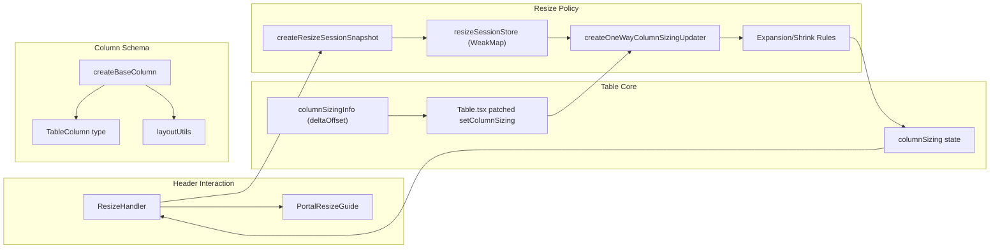
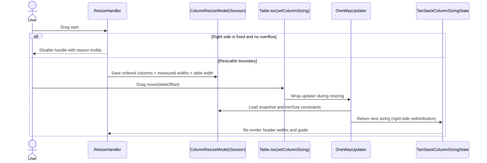

# [83-table] 아키텍처 변경 요약

이번 변경은 컬럼 리사이즈를 TanStack 기본 업데이트에 의존하던 방식에서, 세션 스냅샷 기반의 단방향 재분배 모델로 전환한 작업이다. 핵심은 드래그 시작 시점의 실제 DOM 폭을 캡처하고, 드래그 중에는 오른쪽 컬럼만 재분배 대상으로 삼아 경계 이동을 예측 가능하게 만드는 데 있다. 동시에 `size`를 명시한 컬럼을 고정폭으로 취급하도록 스키마 규칙을 정리하면서, `maxSize` 중심 제약은 타입/문서/API에서 제거했다. 결과적으로 리사이즈 정책의 책임이 `ResizeHandler`와 `Table` 내부 분기에서 분산되던 구조에서 `columnResizeModel`로 명확히 모이게 되었고, pinning/ordering/visibility 조합에서도 동일한 규칙을 유지하도록 테스트 경계가 확장되었다.

## 1) 변경 배경

- 기존 리사이즈는 드래그 직전에 대상 컬럼만 보정하는 방식이라, 복합 기능(고정/순서/가시성) 조합에서 폭 재분배 결과를 예측하기 어려웠다.
- 경계 이동과 실제 드롭 위치 정합성(빈 영역/갭 미발생)을 보장하려면, 드래그 세션 전체에서 동일한 기준 폭 스냅샷이 필요했다.
- `size/minSize/maxSize`가 혼재된 계약은 실제 동작(고정폭 vs 유동폭)과 API 의미가 어긋나 있어, 컬럼 폭 정책을 단순화할 필요가 있었다.

## 2) 변경 전/후 구조

### 변경 요약

- Before: `ResizeHandler`가 이벤트 시점에 대상 컬럼 폭을 보정하고, `table.setColumnSizing`은 TanStack updater를 그대로 적용했다. 폭 분배 정책이 명시적 모델로 분리되지 않아 기능 조합 시 일관성 보장이 어려웠다.
- After: `columnResizeModel`이 드래그 세션 스냅샷 저장, 단방향 폭 재분배, minSize 경계 처리의 단일 책임 계층이 되었고, `Table.tsx`는 리사이즈 중 updater를 래핑해 정책 적용 경로를 고정한다.

### 구조 다이어그램

## 3) 주요 흐름

- 사용자가 리사이즈 핸들을 누르면 `ResizeHandler`가 현재 보이는 leaf 컬럼 순서, 각 헤더 실제 폭, 테이블 폭을 세션으로 저장한다.
- 드래그 중 `columnSizingInfo.deltaOffset`이 발생하면 `Table.tsx`에서 `setColumnSizing` 호출을 가로채 단방향 updater로 래핑한다.
- 확대(+)는 대상 컬럼 오른쪽의 리사이즈 가능 컬럼에서 흡수 가능한 폭만큼 차감해 총 폭 균형을 맞춘다.
- 축소(-)는 우선 overflow를 줄이고, 필요한 경우 오른쪽 첫 리사이즈 가능 컬럼으로 폭을 되돌려 경계 정렬을 유지한다.
- 오른쪽이 모두 고정폭이고 overflow도 없으면 핸들을 비활성화해 불가능한 경계를 사전에 차단한다.

### 시퀀스 다이어그램

## 4) 영향 범위 및 리스크

### 영향 범위

- 리사이즈 정책 계층: `packages/react/src/table/utils/columnResizeModel.ts` 신규 도입으로 세션 상태와 폭 분배 규칙이 독립 모듈화됨.
- 이벤트 진입점: `packages/react/src/table/components/TableHeaderCell/ResizeHandler.tsx`가 스냅샷 수집과 비활성 가드 책임을 갖게 됨.
- 상태 적용 경로: `packages/react/src/table/Table.tsx`에서 `setColumnSizing` 래핑이 추가되어 리사이즈 중 업데이트 경로가 고정됨.
- 컬럼 계약: `packages/react/src/table/types/table.types.ts`, `packages/react/src/table/utils/layoutUtils.ts`, `packages/react/src/table/utils/columnProcessingUtils.ts`에서 `maxSize` 제거 및 `size` 고정폭 규칙으로 단순화됨.
- 검증 경계: ColumnResize 스토리/브라우저 테스트가 pinning + ordering + visibility 조합과 경계 정렬 시나리오까지 확장됨.

### 리스크

- `table.setColumnSizing` 런타임 패치는 TanStack 내부 시그니처 변경 시 취약할 수 있다.
- `maxSize` 제거는 기존 사용자 설정과의 하위 호환 이슈를 유발할 수 있다.
- 세션 스냅샷이 DOM 측정값에 의존하므로, 특수 렌더링 환경(줌/서브픽셀/가상 스크롤 타이밍)에서 경계 오차가 누적될 가능성이 있다.

### 완화 방안

- TanStack 업그레이드 시 `setColumnSizing` 오버라이드 경로를 우선 회귀 테스트하도록 체크리스트화한다.
- 릴리즈 노트에 `maxSize` 제거와 `size` 고정폭 의미를 명시하고 마이그레이션 가이드를 제공한다.
- 브라우저 테스트의 경계 허용 오차(`WIDTH_TOLERANCE`, `NO_GAP_TOLERANCE`)를 유지하며 주요 시나리오 회귀를 자동화한다.

## 5) 후속 작업 / 오픈 질문

- `columnResizeMode = onChange`에서도 세션 정리 타이밍을 명시적으로 둘지 검토가 필요하다.
- 현재 미사용 가능성이 있는 `resizeUtils.ts` 정리 여부를 결정해야 한다.
- `maxSize` 대체 정책(예: 상위 컨테이너 레벨의 레이아웃 가드) 필요 여부를 제품 요구사항과 함께 재확인해야 한다.

## 6) 기준 시점

- 문서 작성 시점: 2026-02-12
- 분석한 git 범위: `origin/main...HEAD`
- 분석에 사용한 merge-base: `7123f4356f8cf4526ae931e1e4e9cc6c62c7a2af`
