# [83-table] 아키텍처 변경 요약  
  
이번 변경은 테이블 컬럼 리사이즈를 "UI 이벤트 처리"와 "폭 계산 정책"으로 분리해, 동작 일관성과 테스트 가능성을 높이는 방향으로 진행되었다. 브랜치 기준으로는 `ColumnResizePolicy` Feature가 TanStack Table 확장 지점에 추가되면서 리사이즈 계산의 중심이 정책 모듈로 이동했다. 워크트리 기준으로는 다단 그룹 헤더에서 리사이즈 핸들 히트박스가 끊기던 문제를 해결하기 위해 `TableHeaderResizeMeta` 컨텍스트 계층이 도입되었다. 결과적으로 헤더 렌더 트리, 리사이즈 세션 수명주기, one-way 폭 분배 규칙이 각각 독립된 경계로 정리되었다.  
  
## 1) 변경 배경  
  
- 다단 그룹 헤더 환경에서 리사이즈 핸들 클릭 영역이 리프 헤더 높이에만 머물러 상위 그룹 구간에서 조작성이 떨어졌다.  
- 리사이즈 중 폭 계산이 UI 핸들러와 강하게 결합되어 정책 변경(흡수/확장 규칙, 최소폭 보장) 시 영향 범위가 넓었다.  
- 리사이즈 기준 폭을 드래그 시작 시점 DOM 기준으로 고정하지 않으면, 세션 중 레이아웃 흔들림으로 일관성이 깨질 수 있었다.  
- 컴포넌트 상호작용(헤더 렌더링, 세션 시작/종료, 폭 계산)을 구조적으로 분리해 테스트 가능한 경계를 만들 필요가 있었다.  
  
## 2) 변경 전/후 구조  
  
### 변경 요약  
  
- Before: `ResizeHandler`가 세션 캡처/가이드 위치/핸들 크기 책임을 함께 가지고, 중첩 그룹의 우측 끝 리프 여부를 구조적으로 표현하는 메타 계층이 없었다.  
- After: `TableHeader`가 컬럼별 `ResizeHandleMeta`를 사전 계산해 컨텍스트로 제공하고, `ResizeHandler`는 `useResizeSessionGuide`와 정책 Feature를 호출하는 얇은 어댑터 역할로 축소되었다.  
  
### 구조 다이어그램  
  
```mermaid  
flowchart LR  
  U["User Drag"] --> H["TableHeader / HeaderCell Tree"]  
  subgraph HeaderLayout["Header Layout Boundary"]    H --> M["buildResizeHandleMetaByColumnId"]    M --> C["TableHeaderResizeMetaProvider"]    C --> R["ResizeHandler"]  end  
  subgraph ResizeSession["Resize Session Boundary"]    R --> G["useResizeSessionGuide"]    G --> T["TanStack Table Instance"]  end  
  subgraph ResizePolicy["One-way Resize Policy Boundary"]    T --> F["ColumnResizePolicy Feature"]    F --> UP["createOneWayColumnSizingUpdater"]    UP --> RL["buildOneWayColumnSizing / columnResizeRules"]  end  
  RL --> S["columnSizing State"]  S --> H  
```  
  
## 3) 주요 흐름  
  
1. 사용자가 헤더 리사이즈 핸들을 누르면 `ResizeHandler`가 `useResizeSessionGuide.captureResizeStart`를 호출한다.  
2. 세션 훅이 `table.startColumnResizeSession`을 통해 시작 시점의 헤더 폭/테이블 폭 스냅샷을 고정한다.  
3. TanStack 리사이즈 이벤트가 `setColumnSizing`으로 전달되면 `ColumnResizePolicy`가 리사이즈 중인 상태에서만 one-way 업데이터로 감싼다.  
4. `columnResizeUpdater`/`columnResizeRules`가 오른쪽 컬럼 흡수/확장 규칙과 최소폭 제약을 적용해 다음 폭 상태를 계산한다.  
5. 헤더 재렌더 시 `TableHeaderResizeMetaProvider`가 제공한 `parentGroupCount`를 기반으로 핸들 높이가 상위 그룹까지 확장되어 일관된 히트박스를 유지한다.  
  
### 시퀀스 다이어그램  

```mermaid  
sequenceDiagram  
  actor User  participant TH as TableHeader  participant RH as ResizeHandler  participant SG as useResizeSessionGuide  participant TT as TanStack Table  participant CP as ColumnResizePolicy  participant CR as columnResizeRules  
  User->>RH: mousedown / touchstart  RH->>SG: captureResizeStart(buttonEl)  SG->>TT: startColumnResizeSession(columnId, tableElement)  RH->>TT: getResizeHandler()(event)  TT->>CP: setColumnSizing(updater)  CP->>CR: buildOneWayColumnSizing(...)  CR-->>CP: nextSizing  CP-->>TT: patched setColumnSizing(nextSizing)  TT-->>TH: rerender with columnSizing  TH-->>RH: resizeHandleMeta(columnId) 제공  
```  
  

  
## 4) 영향 범위  
  
- 영향 모듈  
  - `packages/react/src/table/components/*`: 헤더 렌더 트리와 리사이즈 핸들 UI 경계 분리  
  - `packages/react/src/table/features/*`: `ColumnResizePolicy` Feature 등록/옵션 해석 경로 추가  
  - `packages/react/src/table/utils/*`: one-way 리사이즈 규칙/업데이터 유틸 분리  
  - `packages/react/src/table/spec/*`: 중첩 그룹 시나리오 스토리 및 히트박스 검증 테스트 확장  
- 호환성 영향  
  - 외부 공개 API 영향은 제한적이며, 변경 중심은 내부 헤더 셀 인터페이스(`BaseTableHeaderCell`의 `viewOptions`)와 Feature 파이프라인에 집중된다.  
- 주요 리스크 및 완화  
  - 리스크: 중첩 깊이가 깊은 헤더에서 핸들 오프셋 계산 오류 가능성  
  - 완화: `NestedGroups` 스토리와 `ColumnResize.hitbox.test.tsx`로 상단/하단 경계 검증  
  - 리스크: 리사이즈 세션 종료 누락 시 상태 오염 가능성  
  - 완화: `useResizeSessionGuide`에서 리사이즈 종료/언마운트 정리 로직을 공통화  
  
## 5) 후속 작업  
  
- `onEnd`/`onChange` 모드별로 세션 종료 시점과 가이드 표시 동기화 테스트를 추가한다.  
- 좌/우 고정 컬럼 + 그룹 헤더 조합에서 동일한 히트박스 확장 규칙이 유지되는지 브라우저 테스트를 보강한다.  
- 헤더 구조가 매우 큰 경우 `ResizeHandleMeta` 계산 비용을 측정하고 필요 시 캐시 키 전략(헤더 ID 기반)을 검토한다.  
  
### 오픈 질문  
  
- 그룹 헤더의 우측 끝 판정 기준을 "현재 가시 컬럼"으로 고정할지, 숨김 컬럼 변동까지 포함한 정책으로 확장할지 결정이 필요하다.  
- `TableHeaderResizeMetaProvider`의 범위를 테이블 전체로 유지할지, 헤더 섹션 단위로 분할해 리렌더 범위를 줄일지 추가 검토가 필요하다.  
  
## 6) 기준 시점  
  
- 문서 작성 시점: 2026-02-13  
- 분석한 git 범위:  
  - 브랜치 기준: `origin/main...HEAD` (merge-base: `7123f4356f8cf4526ae931e1e4e9cc6c62c7a2af`)  
  - 워크트리 기준: `HEAD` 대비 unstaged/untracked 변경