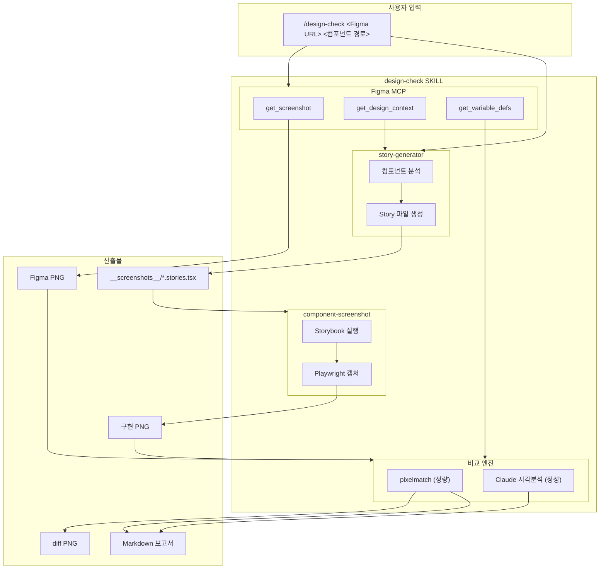

## 전체 흐름



## 데이터 흐름

```
/design-check <Figma URL> <컴포넌트 경로>
          │
          ├─────────────────┬─────────────────┐
          ▼                 ▼                 ▼
    ┌──────────┐     ┌──────────┐     ┌──────────┐
    │ Figma    │     │ story-   │     │ component│
    │ MCP      │     │ generator│     │ screenshot│
    └────┬─────┘     └────┬─────┘     └────┬─────┘
         │                │                │
         ▼                ▼                ▼
    ┌──────────┐     ┌──────────┐     ┌──────────┐
    │ Figma    │     │ Story    │────▶│ 구현     │
    │ PNG      │     │ 파일     │     │ PNG      │
    └────┬─────┘     └──────────┘     └────┬─────┘
         │                                 │
         └────────────┬────────────────────┘
                      ▼
              ┌──────────────┐
              │   비교 엔진   │
              │  pixelmatch  │
              │  + Claude    │
              └──────┬───────┘
                     │
          ┌─────────┼─────────┐
          ▼         ▼         ▼
     ┌────────┐ ┌────────┐ ┌────────┐
     │diff PNG│ │ 정량   │ │ 정성   │
     │        │ │ 결과   │ │ 분석   │
     └────────┘ └────┬───┘ └────┬───┘
                     │          │
                     └────┬─────┘
                          ▼
              ┌──────────────────┐
              │ Markdown 보고서  │
              └──────────────────┘
```

## 주요 컴포넌트

| 컴포넌트 | 파일 | 역할 |
|----------|------|------|
| **capture-screenshot.ts** | `scripts/` | Playwright로 Storybook 캡처 (async) |
| **compare-screenshots.ts** | `scripts/` | pixelmatch로 이미지 비교 (sync) |
| **story-generator** | `.claude/skills/` | 컴포넌트 분석 → Story 생성 |
| **component-screenshot** | `.claude/skills/` | Story → PNG 캡처 |
| **design-check** | `.claude/skills/` | 전체 오케스트레이션 |

## Figma MCP 도구

| 도구 | 용도 |
|------|------|
| `get_screenshot` | Figma 프레임 PNG 추출 |
| `get_design_context` | 크기, 레이아웃 등 디자인 속성 |
| `get_variable_defs` | 디자인 토큰 값 |

## 산출물 경로

```
artifacts/
├── screenshots/
│   ├── figma/{ComponentName}.png
│   ├── impl/{ComponentName}.png
│   └── diff/{ComponentName}.png
└── design-check/
    └── {ComponentName}-report.md
```
