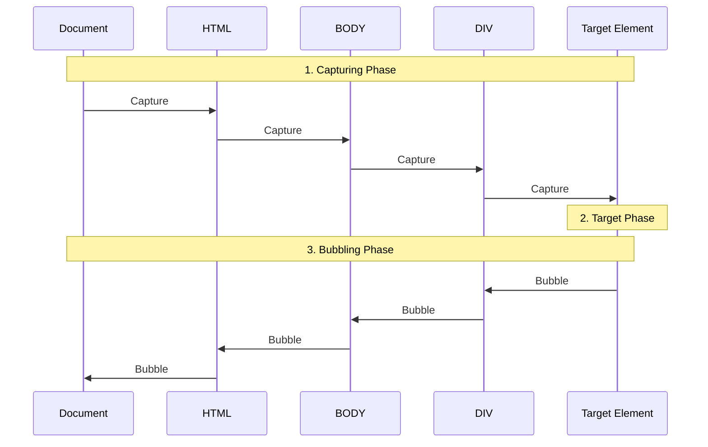

### 1. DOM API 사용법

**1.1 요소 선택**

```jsx
// ID로 선택
const element = document.getElementById('myId');

// 클래스로 선택
const elements = document.getElementsByClassName('myClass');

// 태그 이름으로 선택
const elements = document.getElementsByTagName('div');

// CSS 선택자로 선택 (단일 요소)
const element = document.querySelector('.myClass');

// CSS 선택자로 선택 (모든 일치하는 요소)
const elements = document.querySelectorAll('.myClass');
```

**1.2 요소 생성 및 수정**

```jsx
// 새 요소 생성
const newDiv = document.createElement('div');

// 텍스트 내용 설정
newDiv.textContent = 'Hello, SPA!';

// HTML 내용 설정
newDiv.innerHTML = '<span>Hello, SPA!</span>';

// 속성 설정
newDiv.setAttribute('class', 'greeting');

// 스타일 설정
newDiv.style.color = 'blue';

// DOM에 요소 추가
document.body.appendChild(newDiv);

// 요소 제거
document.body.removeChild(newDiv);
```

**1.3 DOM 트래버싱**

```jsx
const parent = element.parentNode;
const children = element.childNodes;
const siblings = element.siblings;
const nextSibling = element.nextSibling;
const previousSibling = element.previousSibling;
```

### **2. 이벤트 처리와 이벤트 위임**

**2.1 기본 이벤트 리스너**

```jsx
const button = document.querySelector('#myButton');

button.addEventListener('click', function(event) {
    console.log('Button clicked!', event);
});
```

**2.2 커스텀 이벤트**

```jsx
// 커스텀 이벤트 생성
const event = new CustomEvent('myCustomEvent', {
    detail: { message: 'Hello Custom Event!' }
});

// 이벤트 발생
element.dispatchEvent(event);

// 이벤트 리스닝
element.addEventListener('myCustomEvent', function(e) {
    console.log(e.detail.message);
});
```

**2.3 이벤트 버블링과 캡처링**

DOM 구조는 계층적인 트리구조다. 이러한 계층 구조의 특징 때문에 이벤트가 발생하면 연쇄적 이벤트 흐름이 일어나게 된다. 이를 이벤트 전파라 한다.

이벤트 전파의 단계는 다음과 같다:

1. **캡처링 단계** (Capturing Phase)
    - 최상위에서 타겟으로 내려옴
    - Document → HTML → BODY → DIV → 타겟 요소
2. **타겟 단계** (Target Phase)
    - 실제 이벤트가 발생한 요소에 도달
3. **버블링 단계** (Bubbling Phase)
    - 타겟에서 최상위로 올라감
    - 타겟 요소 → DIV → BODY → HTML → Document



이 중 두 가지 핵심 단계가 있다:

_이벤트 캡처링 (Capturing Phase)_

- 이벤트가 최상위 요소(document root)에서 시작하여 이벤트가 발생한 실제 타겟 요소까지 내려가는 단계
- 부모에서 자식으로 이벤트가 전파됨
- addEventListener의 세 번째 매개변수를 true로 설정하여 캡처링 단계의 이벤트를 감지할 수 있음

_이벤트 버블링 (Bubbling Phase)_

- 이벤트가 발생한 요소에서 시작하여 최상위 요소까지 올라가는 단계
- 자식에서 부모로 이벤트가 전파됨
- 대부분의 이벤트 핸들링이 이 단계에서 이루어짐
- 기본적으로 addEventListener는 버블링 단계의 이벤트를 감지

이러한 이벤트 캡처링과 버블링을 사용해 이벤트 위임을 할 수 있다.

**2.4 이벤트 위임**

중첩된 여러 요소들이 각각 이벤트를 처리해야 할 때, 개별 요소마다 이벤트 핸들러를 등록하고 처리하는 것은 낭비가 될 수 있다.

아래와 같은 HTML이 있다고 가정하자:

```html
<div id="ancestor">
    <div id="parent">
   		<div id="child"></div>
    </div>
</div>
```

이벤트를 아래 처럼 등록할경우:

```jsx
ancestor.addEventListener("click", (e) => {
  console.log('ancestor clicked');
})

parent.addEventListener("click", (e) => {
  console.log('parent clicked');
})

child.addEventListener("click", (e) => {
  console.log('child clicked');
})
```

child를 클릭하면 모든 요소의 이벤트 핸들러가 호출된다.

이러한 낭비를 줄이기 위해 이벤트 버블링과 캡처링을 활용한 위임 처리를 사용할 수 있다.

```jsx
document.getElementById('acentor').addEventListener('click', function(e) {
	if (!e.target) return;

  if(e.target.id == "child") {
      console.log("자식 요소 처리하기");
      return;
  }
  ...
});
```

이벤트의 버블링을 중단시킬 수 있다. event 객체의 메서드를 통해 할 수 있는데 다음 두 가지 종류의 메서드가 있다:

- event.stopPropagation(): 이후의 이벤트 전파만 중단. 현재 요소에 걸려있는 다른 핸들러는 실행됨
- event.stopImmediatePropagation(): 이후의 이벤트 전파를 중단. 현재 요소에 걸려 있는 다른 핸들러들의 실행도 중단

우리가 리액트를 사용할 때는 이러한 작업을 하지 않는다. 이는 리액트에서는 이벤트 합성을 통해 이벤트 처리를 최적화 하기 때문이다. 모든 이벤트를 root 요소에 등록해 처리한다. 코드를 간략하게 구현해보면 다음과 같은 형태다:

```jsx
import {
  reactNamesToTopLevelEvents,
  topLevelEventsToReactNames,
} from "./DomEventProperties.js";

const eventMap = new Map();

let rootElement = null;

export function setupEventListeners(root) {
  rootElement = root;

  eventMap.forEach((handlers, eventType) => {
    rootElement.removeEventListener(eventType, handleEvent, true);
  });

  eventMap.forEach((handlers, eventType) => {
    rootElement.addEventListener(
      reactNamesToTopLevelEvents.get(eventType),
      handleEvent,
      true
    );
  });
}

function handleEvent(event) {
  let target = event.target;

  while (target && target !== rootElement) {
    const eventType = topLevelEventsToReactNames.get(event.type);
    const handlers = eventMap.get(eventType);

    if (!handlers) return;

    for (const { element, handler } of handlers) {
      element === target ? handler?.(event) : null;
    }

    target = target.parentNode;
  }
}

export function addEvent(element, eventType, handler) {
  const existing = eventMap.get(eventType);

  eventMap.set(eventType, [...(existing ?? []), { element, handler }]);

  if (!reactNamesToTopLevelEvents.has(eventType)) {
    rootElement.addEventListener(eventType, handleEvent, true);
  }
}

export function removeEvent(element, eventType, handler) {
  const handlers = eventMap.get(eventType);

  if (!handlers || handlers?.length === 0) {
    eventMap.delete(eventType);
    rootElement.removeEventListener(eventType, handleEvent, true);
    return;
  }

  eventMap.set(
    eventType,
    handlers.filter(
      ({ element: el, handler: h }) => el !== element || h !== handler
    )
  );
}
```