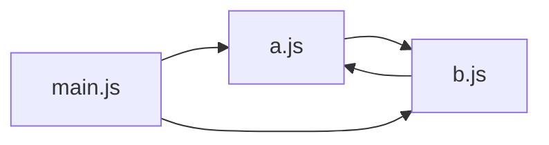
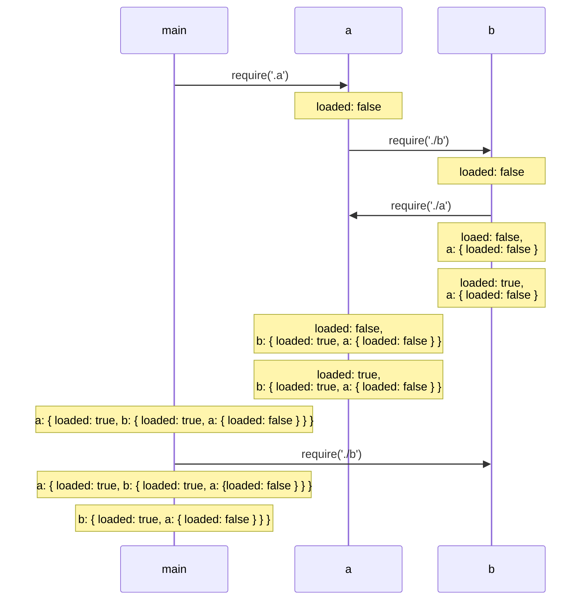

좋은 모듈 시스템은 소프트웨어 엔지니어링의 몇 가지 기본적인 필요성을 마주할 때 도움을 준다.

- 코드 베이스를 나누어 구조적으로 더 잘 관리할 수 있게 해준다
- 독립적인 기능의 조각들을 개발 및 테스트하는 데에 도움을 준다
- 코드를 재사용 할 수 있게 해준다
- 은닉성을 제공한다. 공개 인터페이스를 노출하고, 필요하지 않은 세부 구현을 숨길 수 있게 해준다

> 모듈과 모듈 시스템은 다른다. 모듈 시스템은 문법이며 실제 프로젝트 안에서 모듈을 정의하고 사용할 수 있게 해주는 도구이고, 모듈은 소프트웨어의 실제 유닛이다.

초기에는 자바스크립트에 모듈 시스템이 없었다. 그러나 브라우저 애플리케이션이 점점 복잡해지며 다양한 모듈 시스템을 위한 도구가 생겼다.

가장 성공적인 것이 AMD였다. RequireJS에 의해 대중화되고 이후 UMD가 나오게 된다.

```jsx
// app.js
require(['module'], function (module) {
  const result = module.add(1, 2);
  console.log(result); // 3
});

// module.js
define(function() {
  return {
    add(a, b) {
      return a + b;
    },
    subtract(a, b) {
      return a - b;
    }
  };
});
```

Node.js는 자바스크립트를 위한 서버 런타임이였기에, 모듈 관리에 있어서 새로운 방법을 도입할 수 있는 기회가 있었다. 이 방법이란 HTML과 URL을 통한 리소스 접근에 의존하지 않고 로컬 파일 시스템의 JavaScript 파일들에만 의존하는 것이었다. 이 모듈 시스템을 위한 CommonJS 명세가 구현되었다.

CJS는 Node.js의 주된 모듈 시스템이 되었고 Webpack과 같은 번들러와 함께 브라우저에서도 유명세를 가지게 되었다.

2015년에 ESMAScript 2015의 발표와 함께 표준 모듈 시스템(ESM)을 위한 공식적인 제안이 나오게 된다.

브라우저들과 Node.js 커뮤니티가 명세를 구현하는데 오랜 시간이 소요되고 현재는 Node.js, 브라우저 모두에서 모듈을 관리하는 실질적인 방법이 되어가고 있다.

## 모듈 시스템과 패턴

CommonJS를 구체적으로 알아보기 전에 **노출식 모듈 패턴**에 대해 알아보자. 간단한 모듈 시스템을 만들어 보기 위해 사용할 패턴이자 정보를 감추는데 도움을 주는 패턴이다.

### 노출식 모듈 패턴

자바스크립트의 주요 문제점 중 하나는 네임스페이스가 없다는 것이다. 모든 스크립트가 전역 범위에서 실행된다. 이는 애플리케이션 코드나 종속성 라이브러리가 스코프를 오염시킬 수 있다는 의미다.

전역 범위에 의존하는 것은 매우 위험한 작업이다. 이를 해결하기 위한 보편적인 기법을 **노출식 모듈 패턴**이라고 하며, 다음과 같은 형식을 보인다.

```jsx
const myModule - (() => {
	const privateFoo = () => {};
	const privateBar = [];
	
	const exported = {
		publicFoo: () => {},
		publicBar: () => {},
	}
	
	return exported;
})();

console.log(myModule);
console.log(myModule.privateFoo, myModule.privateBar);
```

이런식으로 정보의 은닉을 유지하고 공개될 API만 포함해서 외부에서는 접근할 수 없도록 할 수 있다.

## CommonJS 모듈

CommonJS 명세의 두 가지 주요 개념을 요약하면 다음과 같다.

- `require`는 로컬 파일 시스템으로부터 모듈을 임포트하게 해준다.
- `exports`와 `module.exports`는 특별한 변수로서 현재 모듈에서 공개될 기능을 내보내기 위해서 사용된다.

### 직접 만드는 모듈 로더

다음의 코드는 Nodejs의 `require()` 함수의 원래 기능 중 일부를 모방한 함수를 만든 것이다. 모듈의 내용을 로드하고 이를 `private` 범위로 감싸 평가하는 함수다.

```jsx
function loadModule(filename, module, require) {
	const wrappedSrc = `
		(function (module, exports, require) {
			${fs.readFileSync(filename, 'utf8')}
		})(module, module.exports, require)
	`
	eval(wrappedSrc);
}
```

모듈의 소스코드는 노출식 모듈 패턴과 마찬가지고 함수로 래핑된다. `module`, `exports`, `require`를 모듈에 전달하고 래핑 함수의 `exports` 인자가 `module.exports` 내용으로 초기화된다.

require() 함수를 구현해보자.

```jsx
function require(moduleName) {
	console.log(`Require invoked for module: ${moduleName}`);
	const id = require.resolve(moduleName); // (1)
	if (require.cache[id]) { // (2)
		return require.cache[id].exports
	}
	
	// 모듈 메타데이터
	const module = { // (3)
		exports: {},
		id,
	}
	
	// 캐시 업데이트
	require.cache[id] = module // (4)
	
	// 모듈 로드
	loadModule(id, module, require) // (5)
	
	// 익스포트되는 모듈 반환
	return module.exports // (6)
}

require.cache = {};
require.resolve = (moduleName) => {
	// 모듈 이름으로 모듈의 전체 경로를 찾아냄
}
```

### 모듈 정의

`require()`가 어떻게 작동하는지 살펴보며, 어떻게 정의하는지 이해할 수 있게 되었다.

```jsx
const dependency = require('./anotherModule');

function log() {
	console.log(`Well done ${dependency.username}`);
}

module.exports.run = () => {
	log();
}
```

### module.exports 대 exports

`loadModule` 함수를 보면 `exports` 변수에 `module.exports`를 할당해서 전달한다. 변수 `exports`는 `module.exports`에 대한 참조일 뿐이다. 그렇기에 차이가 없다.

```jsx
module.exports.hello = () => {}
exports.hello = () => {}
```

### require 함수는 동기적이다.

지금까지 만든 `require()` 함수는 동기적으로 동작한다. Node.js의 `require()` 함수도 마찬가지다. 원래는 비동기 버전의 `require`가 사용되었지만, 과도한 복잡성으로 인해 곧 제거되었다.

### resolving 알고리즘

**종속성 지옥**이라는 용어는 프로그램의 종속성이 서로 공통된 라이브러리에 의존하지만 호환되지 않는 서로 다른 버전을 필요로 하는 상황을 나타낸다.

Node.js는 로드되는 위치에 따라 다른 버전의 모듈을 로드할 수 있도록 하여 이 문제를 우아하게 해결한다. 이 특성의 장점은 패키지 매니저(`npm`, `yarn`, `pnpm`)가 앱의 종속성을 구성하는 방식과 `require` 함수가 사용하는 해결 알고리즘에도 사용된다.

`resolve` 함수는 모듈 이름을 입력으로 사용해 모듈 전체의 경로를 반환한다. 이 경로는 코드를 로드하고 모듈을 고유하게 식별하는데 사용된다. 해결(resolve) 알고리즘은 다음 세가지로 나뉜다.

- 파일 모듈: 모듈 이름이 `/` 로 시작하면 모듈에 대한 절대 경로라고 간주되어 그대로 반환된다. `./` 로 시작하면 상대 경로로 간주되며, 요청한 모듈로부터 시작하여 계산된다.
- 코어 모듈: `/` 또는 `./` 로 시작하지 않으면 알고리즘은 먼저 코어 Node.js 모듈 내에서 검색을 시도한다.
- 패키지 모듈: `moduleName`과 일치하는 코어 모듈이 없는 경우, 요청 모듈의 경로에서 시작해 올라가며 `node_modules` 디렉터리를 찾고 그 안에서 일치하는 모듈을 계속 찾는다. 파일 시스템의 루트에 도달할 때까지 트리를 올라가며 `node_modules`를 찾고 모듈을 찾는다.

파일 및 패키지 모듈의 경우 개별 파일과 디렉터리 모두 `moduleName`과 일치할 수 있다. 그런 경우 다음과 일치하는지 확인한다.

- `<moduleName>.js`
- `<moduleName>/index.js`
- `<moduleName>/package.json`의 main 속성에 지정된 디렉터리/파일

`node_modules`는 패키지 매니저가 패키지의 종속성을 설치하는 곳이다. 각 패키지가 개별적인 종속성을 가질 수 있다.

```jsx
myApp
	foo.js
	node_modules
		depA
			index.js
		depB
			bar.js
			node_modules
				depA
					index.js
				depC
					foobar.js
					node_modules
						depA
							index.js
```

### 모듈 캐시

`require`의 후속 호출은 캐시된 버전을 반환한다. 각 모듈은 처음 로드 될 때만 로드되고 평가된다. 캐싱은 성능을 위해서도 중요하지만 다음과 같은 기능적인 영향도 있다.

- 모듈 종속성 내에서 순환을 가질 수 있다.
- 동일한 모듈이 필요할 때 얼마간 동일한 인스턴스가 항상 반환됨을 보장한다.

모듈 캐시는 `require.cache` 변수를 통해 외부에 노출된다. 직접 접근할수도 있다. 일반적인 사용 사례는 `require.cache` 변수에서 관련 키를 삭제해 캐시를 무효화하는 것이다.

## 순환 종속성

CommonJS가 어떻게 작동하는지 알면 무엇을 조심해야 하는지 알 수 있다. 다음과 같은 상황을 가정해보자.



명백한 순환 종속성이다. 이 두 모듈의 코드를 살펴보자.

**모듈 a.js:**

```jsx
exports.loaded = false;

const b = require('./b');
module.exports = {
	b,
	loaded: true // 이전 export 문을 오버라이드
}
```

**모듈 b.js:**

```jsx
exports.loaded = false;

const a = require('./a');

module.exports = {
	a,
	loaded: true,
}
```

이 모듈이 `main.js`에서 `require` 된다.

```jsx
const a = require('./a');
const b = require('./b');

console.log('a ->', JSON.stringify(a, null, 2));
console.log('b ->', JSON.stringify(b, null, 2));
```

`main.js`를 실행했을 때의 결과를 보겠다.

```jsx
a -> {
	"b": {
		"a": {
			"loaded": false,
		},
		"loaded": true,
	},
	"loaded": true
}
b -> {
	"a": {
		"loaded": false
	},
	"loaded": true
}
```

두 모듈이 각자 `main.js`에서 `require`로 불려지면 완전하게 초기화 되지만, `b.js`에서 `a.js` 모듈을 로드하면 모듈 `a.js`는 불완전한 상태가 된다. 자세히 이해해보기 위해 다음 시퀀스 다이어그램을 보자.



이렇게 순환 참조로 인해서 `b.js`가 모듈 `a.js`의 완전하지 않은 상태를 바라보게 된다.

어떤 모듈이 먼저 로딩되는지를 놓치게 되면 매우 헷갈리는 문제가 될 수 있음을 알았다. 프로젝트 규모가 어느정도 된다면 꽤 쉽게 발생할 수 있는 문제다.

이제 `ESM`에서는 어떻게 순환 종속성 문제를 효과적으로 다루는지 살펴보자.

## ESM: ECMAScript 모듈

`ESM`은 `ECMAScript 2015` 명세의 일부분으로 서로 다른 실행 환경에서도 적합한 공식 모듈 시스템을 부여하기 위해 도입되었다.

`ESM`과 `CJS`의 가장 큰 차이점은 `ESM`은 static 이라는 것이다. 즉, 임포트가 모든 모듈의 가장 상위 레벨과 제어 흐름 구문의 바깥쪽에 기술된다. 동적 생성이 안되고, 상수 문자열만이 허용된다.

다음과 같은 코드는 안된다.

```jsx
if (condition) {
	import module1 from "module1";
} else {
	import module2 from "module2";
}
```

`CommonJS`에서는 동적 임포트가 가능하다.

```jsx
let module = null

if (condition) {
	module = require("module1");
} else {
	module = require("module2");
}
```

불필요한 제약으로 보일 수 있지만, 정적 임포트를 사용하면 CommonJS의 동적인 특성으로 구현했을 때 하지 못하는 일들이 가능해진다. 예를 들어, 사용하지 않는 `코드 제거(Tree Shaking)`과 같이 최적화 해줄 수 있는 종속성 트리의 정적 분석을 가능하게 해준다.

### `Node.js`에서 ESM의 사용

`Node.js`는 모든 `.js` 파일이 CommonJS 문법을 사용한다고 생각한다. 따라서 `.js` 파일에 ESM 문법을 사용한다면 인터프리터는 에러를 낸다. Node.js 인터프리터가 CommonJS 모듈 대신 ESM을 받아들일 수 있는 몇 가지 방법이 있다.

- 확장자를 `.mjs`로 한다.
- 모듈과 가장 근접한 `package.json`의 ‘type’ 필드에 ‘module’을 기재한다.

### exports와 imports 지정하기

ESM은 `export` 키워드를 통해 모듈의 기능을 익스포트하게 해준다.

ES 모듈에서는 기본적으로 모두 private이며 `export`된 개체들만 다른 모듈에서 접근 가능하다.

```jsx
// logger.js
export function log(message) {
	console.log(message);
}

// user.js
export function getUser(cb) {
	return user;
}
```

원하는 모듈에서 개체를 임포트 하고 싶다면 다음과 같이 할 수 있다.

```jsx
// 원하는 모듈을 임포트
import { log } from "./logger.js";

// 내부 모든 모듈을 loggerModule로서 임포트
import * as loggerModule from "./logger.js";

// 임포트된 모듈의 이름을 변경하기
import { log as logA } from "./logger.js";
```

### export와 import 기본값 설정하기(Default exports and imports)

`default export`를 통해 이름이 없는 하나의 개체를 `module.exports`에 할당해 익스포트할 수 있다. 모듈 개발자에게 단일 책임 원칙을 권장하고 깔끔한 하나의 인터페이스를 노출시킨다는 것은 매우 편리하다.

```jsx
// logger.js
export default class Logger {
	contructor(name) {
		this.name = name;
	}
	
	log(message) {
		console.log(`[${this.name}] ${message}`);
	}
}
```

이 경우 Logger라는 이름은 무시되고 default라는 이름 아래 등록된다. 다음의 예제처럼 임포트할 수 있다.

```jsx
// main.js
import MyLogger from "./logger.js";

const logger = new MyLogger('info');
```

이 default export된 모듈의 log를 확인하면 다음과 같이 출력된다.

```jsx
import * as loggerModule from "./logger.js";
console.log(loggerModule);
```

```jsx
[Module] { default: [class: Logger] }
```

실제로 vitest에서 어떤 default export 되는 모듈을 mocking할 때 default에 mocking을 해줘야 정상 동작한다.

다만 다음과 같이 default 개체를 명시적으로 임포트 하는것은 가능하지 않다.

```jsx
import { default } from "./logger.js";
```

### 혼합된 export(mixed exports)

이름이 지정된 export와 default export를 혼합해 사용 가능하다.

```jsx
// logger.js
export default function log(message) {
	console.log(message);
}

export function info(message) {
	log(`info: ${message}`);
}
```

위와 같은 경우 아래처럼 사용할 수 있다.

```jsx
import log, { info } from "./logger.js";
```

### 비동기 임포트

`import` 구문은 정적이기에, 두 가지 주요 제약이 존재한다.

- 모듈 식별자는 런타임에 생성될 수 없다.
- 모듈의 임포트는 모든 파일의 최상위에 선언되며, 제어 구문 내에 포함될 수 없다.

이런 제약점이 과도한 제약이 되는 경우가 있다. 사용자 언어를 위한 특정 번역 모듈을 임포트해야 하거나, 운영체제에 의존하는 모듈을 임포트 하는 경우가 그렇다.

ES 모듈은 이러한 제약을 극복하기 위해 비동기 임포트를 제공한다. 비동기 임포트는 특별한 `import` 연산자를 사용해 실행 중에 수행된다.

`import` 연산자는 모듈 식별자를 인자로 취하고 모듈 객체를 프라미스로 반환한다.

```jsx
let moduleName = "default module";
let someCase = "default case";

switch(someCase) {
	case "case a":
		moduleName = "aModule";
		break;
	case "case b":
		moduleName = "bModule";
	...
	default:
		break;
}

import(moduleName).then((module) => {
	module.doSomething();
});
```

### 모듈 적재 이해하기

ESM이 어떻게 동작하고 순환 종속성을 다루는지 이해하기 위해서는 ES 모듈을 사용할 때 JavaScript 코드가 어떻게 파싱되고 평가되는지 좀 더 알아봐야 한다.

**로딩 단계**

인터프리터의 목표는 필요한 `모든 모듈의 그래프(종속성 그래프)를 만들어 내는 것`이다.

인터프리터는 **모듈이 실행되어야 할 코드의 순서**와 함께 **모듈 간에 어떠한 종속성**을 갖는지 이해하기 위해 종속성 그래프를 필요로 한다. 진입점에서부터 필요한 모든 코드가 탐색되고 평가될 때까지 `import` 구문을 재귀적인 깊이 우선 탐색으로 찾는다.

구체적으로 다음 3단계에 걸쳐 작업이 진행된다.

1. **생성(파싱)**: 모든 import 구문을 찾고 재귀적으로 각 파일로부터 모든 모듈의 내용을 적재한다.
2. **인스턴스화**: 익스포트된 모든 개체들에 대해 명명된 참조를 메모리에 유지한다. 모든 import 및 export된 문에 대한 참조가 생성되어 이들 간의 종속성 관계를 추적한다. 이 단계에서 어떠한 JS 코드도 실행되지 않는다.
3. **평가**: 코드를 실행한다. 이전에 인스턴스화된 모든 개체가 실제 값을 얻을 수 있도록 한다. 이 단계가 끝나면 진입점에서부터 코드를 실행할 수 있게 된다.

간단하게 말하자면

1. 모든 점들을 찾는 것
2. 각 점들을 연결해 길을 만드는 것
3. 올바른 순서로 걷는 것

이게 ESM이 동작하는 방식이다. CommonJS와는 근본적인 차이가 존재한다.

CommonJS는 동적인 특성으로 인해 **종속성 그래프가 탐색되기 전에 모든 파일들을 실행**한다. ESM에서는 이게 완전히 분리되어 있다. 종속성 그래프를 먼저 그리기 전까지 어떠한 코드도 실행시키지 않는다.

**읽기 전용 라이브 바인딩**

ES 모듈의 또 다른 기본적인 특성은 임포트된 모듈이 익스포트된 값에 대해 읽기 전용 라이브 바인딩 된다는 개념이다.

다음과 같은 코드를 보자:

```jsx
// counter.js
export let count = 0;
export function increment() {
	count++;
}
```

이 코드를 사용하는 코드를 보자:

```jsx
import { count, increment } from "counter.js";

console.log(count) // 0을 출력

increment();

console.log(count); // 1을 출력
count++ // TypeError: Assignment to constant variable!
```

ESM 모듈에서는 count 변수를 직접적으로 변경하려 하면 const로 바인딩된 값을 변경하려 했을 때 발생하는 에러가 나타나게 된다. 이는 스코프 내에 개체가 임포트 되면 변경 불가 하다는 것이다.

CommonJS에서는 `require`를 통해 모듈을 불러오면 얕은 복사가 된다. 이는 이 안의 값을 변경했을 때 이 변화를 모듈이 알 수 없다는 것이다.

**순환 종속성 분석**

CommonJS 모듈 섹션에서 보았던 순환 종속성 예제를 다시 보자.


a.js:

```jsx
import * a s bModule from "./b.js";

export let loaded = false;
export const b = bModule;
loaded = true;
```

b.js:

```jsx
import * as aModule from "./a.js";
export let loaded = false;
export const a = aModule;
loaded = true;
```

main.js:

```jsx
import * as a from "./a.js";
import * as b from "./b.js";
console.log('a ->', a);
console.log('b ->', b);
```

main.js를 실행하면 다음과 같은 출력을 볼 수 있다.

```jsx
a -> <ref * 1> [Module] {
	b: [Module] { a: [Circular * 1], loaded: true },
	loaded: true
}

b -> <ref * 1> [Module] {
	a: [Module] { b: [Circular * 1], loaded: true },
	loaded: true
}
```

CommonJS와는 다르게 완전한 내용을 가지고 있다. 모든 loaded 값이 true로 설정되어 있다. 이 예제를 토대로 모듈 분석 3단계에 대해서 조금 더 깊게 살펴보자.

**1단계: 파싱**

파싱 단계에서는 진입점(main.js)에서부터 코드의 탐색이 시작된다. 필요한 모든 모듈을 찾고 소스 코드를 적재하기 위해 오직 `import` 구문만을 찾는다. 깊이 우선으로 종속성 그래프가 탐색되고 모든 모듈이 한번씩만 방문된다.

![[Pasted image 20250103091943.png]]

다음과 같은 일들이 일어난다:

1. main.js에서 처음으로 발견된 import문이 a.js로 향하게 한다.
2. a.js에서 b.js향하는 import문을 발견한다.
3. b.js에서 a.js로 향하는 순환문이 있다. a.js는 이미 방문했기 때문에 그 경로는 다시 탐색되지 않는다.
4. b.js에서 또 다른 import문이 없기 때문에 main.js로 돌아간다. b.js의 임포트를 발견하고 이미 탐색되었기 때문에 그 경로는 무시된다.

그래서 순환 모듈 참조가 제거되어 다음과 같은 모습을 가지게 된다.

![[Pasted image 20250103091935.png]]

**2단계: 인스턴스화**

인스턴스화 단계에서는 인터프리터가 이전 단계에서 얻어진 트리 구조를 따라 아래에서 위로 움직인다. 모든 모듈의 익스포트된 속성을 먼저 찾고 메모리에 익스포트된 이름의 맵을 만든다.

![[Pasted image 20250103091925.png]]

다음은 그 순서다:

1. b.js에서 시작해서 loaded와 a를 익스포트하는 것을 포착한다.
2. 인터프리터는 loaded와 b를 익스포트하는 a.js로 이동한다.
3. 모듈 a.js에서도 똑같은 작업을 하고 main.js로 이동한다. 더 이상 익스포트가 없다.
4. 익스포트 맵에서 익스포트된 이름의 추적을 한다. 연관된 값은 현재로는 인스턴스화 되지 않은걸로 간주한다.

이 단계를 거치고 인터프리터는 임포트를 하는 모듈에게 익스포트된 이름의 링크를 전달한다.

![[Pasted image 20250103091908.png]]

다음의 단계들을 통해 설명할 수 있다:

1. 모듈 b.js는 aModule이라는 이름으로 a.js에서의 익스포트를 연결한다.
2. 모듈 a.js는 bModule이라는 이름으로 b.js에서의 익스포트를 연결한다.
3. main.js는 b라는 이름으로 b.js에서의 모든 익스포트를 연결하고, a라는 이름으로 a.js의 모든 익스포트를 연결한다.
4. 모든 값은 아직 인스턴스화되지 않았다. 이 단계에서는 참조만을 연결한다.

**3단계: 평가**

모든 파일의 모든 코드가 실행된다. 종속성 그래프에서 후위 깊이 우선 탐색으로 다시 아래에서 위로 올라간다. 마지막에 실행되는 파일은 진입점인 main.js 파일이다.

![[Pasted image 20250103091855.png]]

단계에 대한 과정은 아래와 같다:

1. b.js부터 수행되며, 첫 번째 라인에서 loaded 값이 false가 된다.
2. export되는 속성 a가 평가된다. a.js를 타나내는 모듈 객체에 대한 참조가 할당된다.
3. loaded가 true로 변경된다.
4. b.js의 익스포트 평가가 끝났다.
5. a.js로 이동하고 똑같은 과정을 거친다.
6. main.js로 이동하고 같은 과정을 거친다.

각 모듈의 평가가 이동될 때 모든 속성값들이 완전히 평가된 채 이동된다. 그렇기에 순환 종속성이 존재해도 최신 상태를 보장할 수 있게 된다.

### 모듈의 수정

앞서 살펴 본것처럼 ESM에서는 임포트시 해당 모듈이 `read-only` 상태가 된다. 다만 주의할 점이 있다. 임포트하는 모듈이 객체라면 객체의 특정 속성을 재 할당하여 변경하는 것이 가능하다.

모듈 `fs`의 동작을 바꾸어 모의 데이터를 리턴하도록 하는 모듈을 작성해보자.

```jsx
// mock-read-file.js
import fs from "fs";

const originalReadFile = fs.readFile;
let mockedResponse = null

function mockedReadFile(path, cb) {
	setImmediate(() => {
		cb(null, mockedResponse);
	});
}

export function mockEnable(repondWith) {
	mockedResponse = respondWith;
	fs.readFile = mockedReadFile;
}

export function mockDisable() {
	fs.readFile = originalReadFile;
}
```

다음과 같이 사용할 수 있다.

```jsx
import fs from "fs";
import { mockEnable, mockDisable } from "./mock-read-file.js";

mockEnable(Buffer.from("Hello World"));

fs.readFile("fake-path", (err, data) => {
	if (err) {
		console.error(err);
		process.exit(1);
	}
	console.log(data.toString());
});

mockDisable();
```

다만 위 처럼 `default export`를 임포트 하는 방식이 아닌 구조분해를 통해 임포트 하게 되면 동작하지 않을 수 있다.

```jsx
import { readFile } from "fs";
```

이는 모의 유틸이 `default export`로 익스포트된 객체의 내부에 등록된 `readFile`의 복사만을 대체하기 때문이다.

module 패키지에 있는 `syncBuiltinESMExport` 함수를 이용해 default exports 객체에 있는 속성들의 값이 named exports와 동일한 것을 매핑되게 할 수 있다.

```jsx
import fs, { readFileSync } from "fs";
import { syncBuildtinESMExports } from "module";

fs.readFileSync = () => Buffer.from("Hello, ESM");
syncBuiltinESMExports();

console.log(fs.readFileSync === readFileSync); // true
```

## ESM과 CommonJS의 차이점과 상호 운용

CommonJS의 require 함수에서는 파일의 확장자 표시를 선택적으로 하는 반면, ESM에서는 명시적으로 파일의 확장자를 표시해야 하는 것과 같이 ESM과 CJS 사이의 몇 가지 중요한 차이점에 대해 알아보자.

### strict 모드에서의 ESM

ESM은 암시적으로 strict mode에서 실행된다. 그리고 이를 해제할 수 없다. 선언되지 않은 변수, with 구문 non-strict mode에서만 사용가능한 것들을 사용할 수 없다.

### ESM에서의 참조 유실

ESM 모듈이 strict mode에서 실행되기 때문에 require, export, module, exports, __filename, __dirname을 포함해 CJS의 몇 가지 중요한 참조가 정의되지 않는다.

ESM에서는 특별한 객체인 import.meta를 사용해 현재 파일에 대한 참조를 얻을 수 있다. import.meta.url은 현재 모듈을 참조하며 [file:///path/to/current_module.js](file:///path/to/current_module.js) 의 형식이다. 이 값으로 절대 경로 형식에 대한 __filename과 __dirname을 구현할 수 있다.

```jsx
import { fileURLToPath } from "url";
import { dirname } from "path";
import { createRequire } from "module";

const __filename = fileURLToPath(import.meta.url);
const __dirname = dirname(__filename);

const require = createRequire(import.meta.url);
```

이제 require를 ESM에서 사용할 수 있다. 이 함수의 흥미로운 차이점은 this이다. ESM의 전역 범위에서 this는 undefined인 반면, CJS는 this가 exports와 같은 참조를 가지고 있다.

### 상호 운용

ESM에서 표준 import 문법을 사용해 CJS 모듈을 임포트 할 수 있다. 다만 default exports에 한정된다.

```jsx
import pacakageMain from "commonjs-package"; // 작동
import { method } from "commonjs-package"; // 에러
```

CJS에서 ES 모듈을 임포트하는 것은 불가능하다.

CJS에서 자주 사용하는 기능인 JSON 파일을 직접 가져오기는 ESM에서 불가능하다. 다음 import는 동작하지 않는다.

```jsx
import data from "./data.json";
```

이런 제한을 극복하려면 module.createRequire 유틸을 사용할 수 있다.

```jsx
import { createRequire } from "module";
const require = createRequire(import.meta.url);
const data = require("./data.json");
console.log(data);
```
