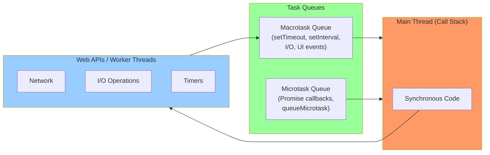
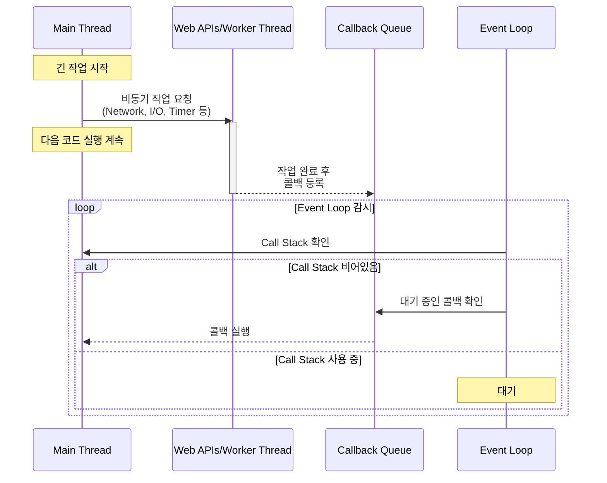
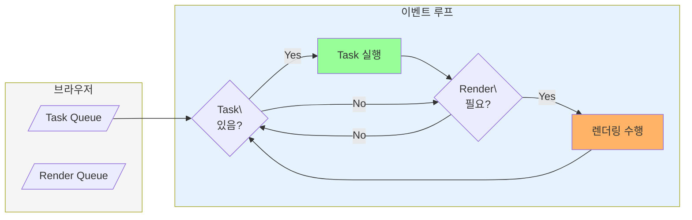
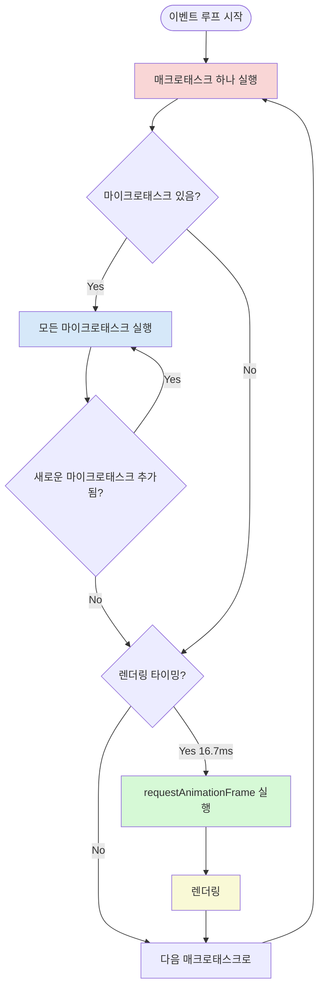
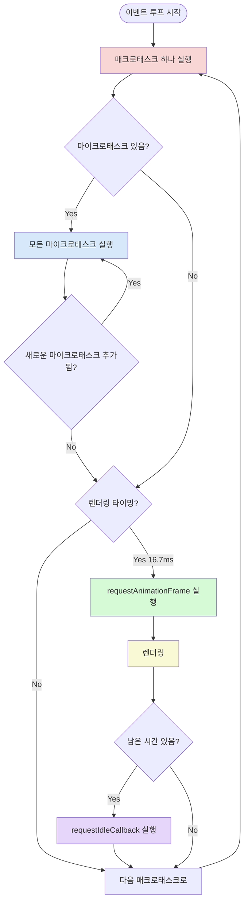

자바스크립트는 싱글 스레드 프로그래밍 언어다. 이는 하나의 콜 스택만을 가진다는 의미이며, 동시에 하나의 코드만 실행할 수 있다는 것이다.

![[Pasted image 20250201122346.png]]

이렇게 긴 작업 시간을 소요하는 일을 하게 되면 이후의 작업을 할 수 없게 된다.

이는 자바스크립트 실행환경인 서버, 브라우저에서 문제가 된다. 네트워크 요청이나 I/O 작업 같이 메인스레드를 오랜시간 점유할 수 있는 작업들이 일어나기 때문이다.

이를 브라우저나 Node에서는 이벤트 루프와 Task 큐를 사용해 해결한다. 별도 스레드를 통해 비동기 작업을 큐로 관리하여 수행하고, 비동기 작업이 완료되면 Promise는 관련 콜백을 실행할 수 있음을 이벤트 루프에 알리는 식으로 동작한다.





이전의 이벤트루프는 이런 모습이 아니였다. 거의 다음과 같은 코드의 형태였다:

```jsx
while (true) {
	if (execQueue.isNotEmpty()) {
		execQueue.pop().exec();
	}
}
```

하지만 모던 브라우저에서의 이벤트 루프는 아주 복잡해졌다. 그에 대해 이벤트 루프를 사이클의 형태로 설명하며 알아가보자. 지금은 다음과 같이 그릴 수 있다.

![[Pasted image 20250201123232.png]]

이벤트 루프에서는 다음과 같은 작업들이 실행될 수 있다:

1. `<script>` 태그
2. 지연된 태스크들: setTimeout, setInterval, requestIdleCallback
3. 브라우저 API 또는 이벤트 핸들러들: click, mousedown, input, blur 등
    1. 클릭이나 탭 전환 등과 같이 사용자가 시작하는 이벤트들
    2. 코드로 발생되는 이벤트들: XmlHttpRequest 응답 핸들러, fetch Promise resolve
4. Promise 상태 변경
5. DOMMutationObserver, IntersextObserver 와 같은 옵저버들
6. RequestAnimationFrame

거의 모든 것들이 WebAPI를 통해 일어난다.

만약 다음과 같은 코드가 있다고 가정해보자.

```jsx
setTimeout(function a() {}, 100);
```

100ms가 지나면 WebAPI가 `function a()`를 큐에 넣는다. 이 큐를 TaskQueue라고 부른다. 이벤트 루프는 다음 순회에 이 작업을 큐에서 꺼내 실행시킨다.

이벤트 루프에서는 자바스크립트를 실행하기도 하지만 DOM과도 일할 수 있어야 한다.

- DOM 요소의 데이터를 읽을 수 있어야 한다: size, attribute, position, etc.
- 어트리뷰트를 수정할 수 있어야 한다: data-attr, width, height, position, etc.
- HTML 노드를 생성/제거 할 수 있어야 한다.

브라우저들은 JS와 렌더링을 같은 스레드에서 실행한다(페인트나 그리기 작업은 아닐 수 있음).

이는 렌더링 또한 이벤트 루프의 일부라는 의미다. 렌더링 작업은 render queue에 들어간다:

![[Pasted image 20250201123243.png]]

그럼 브라우저는 JS 작업과 렌더링 작업의 순서를 어떻게 결정할까? 이 답을 위해 먼저 화면 업데이트 문제를 살펴봐야 한다.

### 화면 업데이트

이벤트 루프는 프레임과 연결되어 있다. 프레임은 유저가 현재 보고있는 화면에 대한 스냅샷이라 생각하면 된다.

브라우저는 소프트웨어, 하드웨어 제한을 고려한채 최대한 빠르게 페이지를 업데이트 하려고 한다:

- 하드웨어 제한: 주사율
- 소프트웨어 제한: 운영 체제 설정, 브라우저 설정, 에너지 절약 모드 등등

60FPS에서 웹 사이트를 본다고 생각하면, 브라우저는 새로운 프레임을 렌더링 하기 전에 16.6ms의 타임 슬롯이 있는거다.

### Task Queue와 Micro Task Queue

위 그림의 someTasks에 대해 자세히 알아보자.

브라우저는 자바스크립트를 실행하기 위해 2가지 큐를 사용한다.

- Task Queue(Macro Task Queue): 모든 이벤트와 연기된 작업들
- Micro Task Queue: Promise 콜백 (resolved, rejected 둘 다), MutationObserver

**Task Queue**

브라우저가 새로운 작업을 받으면 TaskQueue에 넣는다. 이벤트 루프는 사이클을 돌며 TaskQueue에서 작업을 꺼내 실행시킨다. 작업이 끝나고 브라우저가 시간이 있다면(Render Queue에는 작업이 없다고 가정), Task Queue에서 다른 작업을 꺼내 실행시킨다. 이는 Render Queue에 작업이 있을 때 까지 진행된다.

예를들어:

![[Pasted image 20250201123259.png]]

Task Queue에 A, B, C라는 3가지 작업이 있다.

1. TaskA를 꺼내 실행시킨다.
2. 4ms가 걸렸고 다른 큐를 체크한다(Micro Task Queue, Render Queue에서).
3. 이 큐들이 비어있다면 다시 TaskQueue에서 B를 꺼내 실행시킨다. 16ms가 걸렸다.
4. 브라우저가 새로운 프레임을 그리라는 작업을 RenderQueue에 넣는다.
5. 이벤트 루프가 이를 체크하고 RenderQueue의 작업을 실행시킨다. 1ms 정도 걸렸다.
6. 2번의 작업을 반복하고 모두 비어있다면 TaskC를 실행한다.

이 예제를 보면 알겠지만 이벤트 루프는 한계가 있다. 실행하는 작업이 얼마나 걸릴지 알 수 없다는 것이다. 그렇다고 해서 이벤트 루프가 렌더링을 위해 작업을 중단할 수도 없다.



그렇기에 다음 예제처럼 한 작업이 긴 시간을 소요하게되면

![[Pasted image 20250201123312.png]]

240ms의 지연은 60FPS의 환경에서 14개의 프레임을 놓치게 됨을 의미한다. 14개를 놓치게 된다는게 작업이 끝나고 14개의 프레임을 순서로 그려낸다는 의미는 아니다. 14개를 놓치고 15번째의 프레임만 그리게 되는 것이다.

**Micro Task Queue**

Micro Task Queue에 들어갈 수 있는 작업의 소스는 두 가지다. Pomise 콜백과 MutationObserver 콜백이다. MicroTask는 하나의 주요한 특징이 있다:

> MicroTask는 콜스택이 비면 바로 실행된다.

Micro Task의 실행이 모두 완료되어야 이후의 렌더큐의 작업이나, Macro TaskQueue의 작업을 진행할 수 있다.

![[Pasted image 20250201123322.png]]

### RequestAnimationFrame (RAF)

현재 까지의 내용을 정리하면 TaskQueue 작업 하나 실행 → MicroTaskQueue 작업 모두 실행 → 렌더큐 작업 실행 의 순서가 된다.

이 렌더큐의 작업은 아무때나 실행되지 않는다. 렌더링 타이밍 일때만 실행된다. 렌더링 작업을 실행하는데 렌더링 작업의 내부는 다음과 같이 생겼다.

![[Pasted image 20250201123330.png]]

RAF는 다음과 같은 특징을 가진다.

- RAF는 id를 반환하고, 이를 사용해서 중지할 수 있다(`cancleAnimationCallback(id)`).
- 유저가 탭을 변경하고나, 최소화 하는것과 같이 리렌더링을 유발하지 않는다면 RAF도 실행되지 않는다.
- 사파리에서는 RAF가 렌더링 된 이후에 호출된다.

그래서 현재까지의 동작을 정리해보면 다음과 같다.



### requestIdleCallback

브라우저에는 requestIdleCallback이라는 함수도 있다. 이 함수는 콜백을 TaskQueue에 넣는다. 다만 일반적인 태스크와는 다른 특별한 특징을 가진다.

- 가장 낮은 우선순위를 가진다.
- 다른 모든 작업이 완료된 후 실행된다.
- 브라우저가 유휴 상태일 때만 실행 된다. 즉 한 프레임에서 남은 시간이 있을 때 실행된다.

그래서 이 함수까지 포함한 전체 플로우를 보면 다음과 같다.



실제로 확인해보기
https://www.jsv9000.app/
