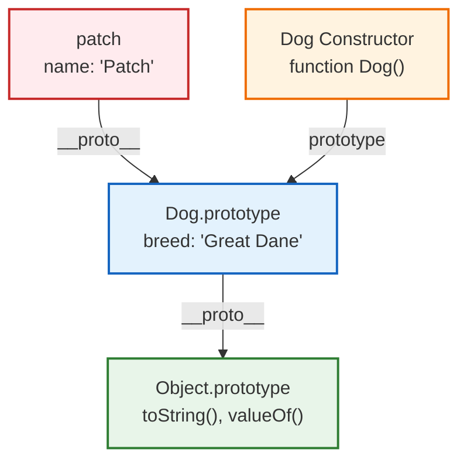
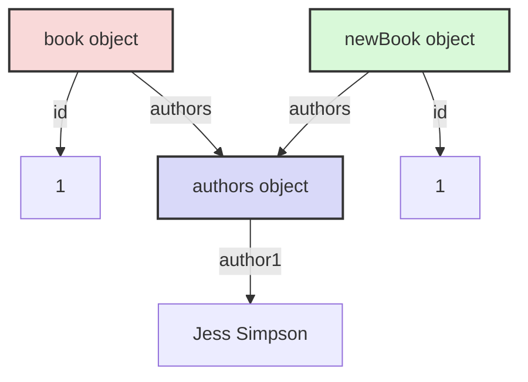

> [원문](https://github.com/mikeesto/prototype-programming/blob/master/README.md)
## 소개(Introduction)
프로토타입 기반 프로그래밍(Prototype Baesd Programming)은 객체 지향 프로그래밍(Object Orientated Programming)의 한 형태이다. 클래스가 없고 객체에만 의존하기 때문에 일반적으로 객체 기반 프로그래밍(Object Based Programming)이라고 불린다. 객체는 값, 메서드, 다른 객체에 대한 참조 등을 가질 수 있다.

## 역사적 맥락(Historical Context)
[[Self]]는 1986년 설계되었으며, 최초의 프로토타입 지향 프로그래밍 언어 중 하나였다. 최근 몇 년간 자바스크립트의 부상으로 인해 이 패러다임이 점점 더 인기를 얻게 되었다. 전통적으로 자바스크립트는 스크립트 언어로 사용되었다. 하지만 프론트엔드 애플리케이션의 복잡성이 증가하고 서버 사이드에서 Node.js가 발점함에 따라, 자바스크립트 커뮤니티는 점진적으로 프로토타입 기반 접근 방식을 선호하게 되었다.

오늘 우리는 프로토타입 기반 프로그래밍의 역사적 배경, 프로토타입의 사용 방법, 그리고 주요 장저과 한계에 대해 논의한다. 또한 ECMAScript 2015에서 도입된 자바스크립트 클래스들을 살펴보고, 왜 일부 평론가들이 이것을 자바스크립트의 기존 프로토타입 기반 시스템을 위한 문법적 설탕이라고 비판하는지 설명할 것이다. 마지막으로, 다른 프로그래밍 패러다임들의 맥락에서 프로토타입 기반 프로그래밍에 대한 성찰을 제공할 것이다.

현재 많은 언어들이 프로토타임 기반 프로그래밍을 지원하고 있지만, 자바스크립트 예제가 사용될 것이다.

## 역사적 배경(Historical background)
프로토타입의 개념은 20세기의 추상화 표현에 대한 철학적 논쟁으로 거슬러 올라간다. 당시 루드비히 비트겐슈타인은 어떤 범주를 정의하는데 필요한 정확한 특성을 미리 말하기 어렵다는 것을 관찰했다. 대신 비트겐슈타인은 현재 프로토타입 기반 프로그래밍의 기원으로 여겨지는 '가족 유사성'이라는 개념을 제안했다. 이 개념은 특정 범주의 개게들이 여러 유사성으로 연결될 수 있지만, 반드시 그 범주의 객체에 공통된 하나의 특징이 있어야 하는 것은 아니라고 주장한다. 따라서, 가족 유사성 접근방식은 어떤 객체가 해당 범주의 표준적인 표현과 휴사한지를 고려하여 그 객체가 특정 범주에 속하는지를 결정한다.

헨리 리버만은 1986년 그의 논문에서 프로토타입과 위임의 개념을 객체 지향 패러다임의 대안으로 대중화했다. 리버만은 코끼리를 분류하려는 예시를 통해 프로토타입을 소개했다. 간단히 말해서, 이 예시는 코끼리를 한 번도 보거나 들어본 적이 없는 존이라는 개인을 고려한다. 만약 존이 밥이라는 이름의 코끼리를 만단다면, 존이 코끼리에 대해 생각할 때 밥을 떠올릴 것이다. 왜냐하면 그것이 존이 가진 유일한 구체적인 코끼리의 예시이기 때문이다. 만약 존이 그 후에 밥보다 작은 사라라는 다른 코끼리를 만단다면, 존은 사라를 밥과 비슷하지만 크기가 더 작은 것으로 분류할 것이다.

리버만의 예시는 프로토타입 기반 프로그래밍의 주요 아이디어가 구체적인 예시를 사용해 객체를 표현하고, 그 다음 복제나 새로운 속성 추가를 통해 모델의 새로운 지식을 표현하는 것임을 보여준다.

## 객체 생성(Object creation)
객체는 속성들의 집합이다. 속성은 키와 값 사이의 연관 관계이다. 속성의 값은 함수가 될 수도 있는데, 이 경우 그 속성을 메서드라고 부른다. 자바스크립트에서 객체를 생성하는 방법은 여러 가지가 있지만, 모두 '무(無)에서의 객체 생성' 또는 '기존 객체의 복제'라는 두 가지 범주 중 하나에 속한다.

무(無)에서의 객체 생성은 기존에 정의된 객체를 복제하지 않고도 새로운 객체를 생성할 수 있게 해준다:
```js
// 리터럴 객체 표기법을 통한 생성
const dog = { name: "Max", breed: "Poodle" };
```

리터럴 객체 표기법을 통한 생성의 대안은 생성자 함수를 작성하고 객체 인스턴스를 `new` 키워드와 함께 생성하는 방식이다. 각 인스턴스 객체들은 자신만의 프로퍼티를 가진다:
```js
function Dog(name, breed) {
	this.name: name,
	this.breed: breed,
	bark: function () {
		console.log("Woof!");
	},
};

const poodle = new Dog("Max", "Poodle");
const dalmatian = new Dog("Bobby", "Dalmatian");

console.log(poodle.name); // 'Max'
console.log(dalmatian.name); // 'Bobby'
```

`Object.create` 메서드는 명시적으로 정의된 생성자 함수 대신 사용될 수 있다:
```js
const Dog = {
	name: "Max",
	breed: "Poodle",
	bark: function () {
		console.log("Woof!");
	},
};

const max = Object.create(Dog);
max.bark(); // Woof!
```

기존 객체의 동작을 복제해서 새로운 객체를 생성할수도 있다. 복사된 객체는 기존의 객체와 같은 프로퍼티들을 가지게된다. 생성된 객체를 수정해도 원본에는 영향을 미치지 않는다:
```js
var dog = { name: 'Max', breed: 'Poodle' };

var newDog = Object.assign({}, dog);

console.log(dog.name); // 'Max'
console.log(newDog.name); // 'Max'

newDog.name = "Jessica";

console.log(dog.name); // 'Max'
console.log(newDog.name); // 'Jessica'
```

## 위임과 상속(Delegation and Ingeritance)
프로토타입 기반 프로그래밍의 핵심 메커니즘은 위임(delegation)이다. 객체는 위임을 통해 복제되고 확장될 수 있다. 이 메커니즘의 원리는 객체의 속성을 찾을 때, 해당 객체뿐만 아니라 프로토타입 체인을 따라 연결된 모든 객체들을 순차적으로 탐색한다는 것이다. 객체들은 `prototype` 속성을 통해 직접적으로 상속받는다. 모든 객체는 다른 객체로 연결되는 프로토타입 링크를 가지고 있다. 기본적으로 객체들은 `Object.prototype` 객체에 연결되어 있다.
```js
const Dog = function () {
	this.name = "Patch";
}

const patch = new Dog();

Dog.prototype.breed = "Great Dane";

console.log(patch.name); // Patch
console.log(patch.breed); // Great Dane
```

위 예제에서 `patch` 객체는 `name` 속성을 가지고 있다. `breed` 속성은 프로토타입 체인을 따라가며 프로토타입을 탐색해서 찾을 수 있다. `Dog`의 `.prototype` 속성을 사용하면 새로운 속성들을 할당할 수 있고, `Dog` 생성자 함수로부터 새로운 객체가 생성될 때 이러한 속성들을 사용할 수 있게 된다.

프로토타입 체인을 시각화 하면 다음과 같이 나타낼 수 있다:


문자열이나 배열과 같은 자바스크립트의 내장 객체 프로토타입을 포함한 모든 객체들은 프로토타입을 사용해 변경하거나 확장할 수 있다. 하지만 이는 코드 통합의 관점에서 볼 때 일반적으로 나쁜 관행으로 여겨진다. 자바스크립트에서는 내장 프로토타입의 표준 구현에 의존하는 라이브러리와 프레임워크를 사용하는 것이 매우 일반적이다. 또한, 팀 단위로 작업할 때 이미 존재하는 자바스크립트 객체를 수정하는 것은 혼란을 야기하고 많은 시간을 낭비하게 할 수 있다. 거의 모든 경우에 원하는 기능을 구현하기 위해서는 새로운 객체를 생성하는 것이 더 적절하다.

## 복제(Cloning)
`Object.assign()`을 사용해 객체를 복제하면, 해당 객체의 최상위 속성들은 참조없이 새로운 객체로 복사된다. 하지만 값이 객체에 대한 참조인 경우, 그 값이 아닌 참조가 복사된다:
```js
const book = {
	id: 1,
	authors: {
		author1: "John Jims",
	}
};

const newBook = Object.assign({}, book);

console.log(book.authors.author1); // John Jims;
console.log(newBook.authors.author1); // John Jims;

book.authors.author1="Jess Simpson";

console.log(book.authors.author1); // Jess Simpson
console.log(newBook.authors.author1); // Jess Simpson
```

위 예제에서, `newBook`은 프로토타입에 대한 링크를 유지한다. 프로토타입 객체의 참조값이 변경되면 `newBook`에도 해당 변경사항이 반영된다.


## 'this'의 사용
프로토타입 기반 프로그래밍에서는 프로퍼티의 형태로 객체에 함수를 추가할 수 있다. 상속된 프로퍼티는 다른 프로퍼티와 동일하게 동작한다. 상속된 함수가 호출되면 `this`의 값은 함수 프로퍼티가 선언된 프로토타입 객체가 아니라 상속된 객체를 가리키게 된다.

```js
const calculate = {
	num: 5,
	sum: function() {
		return this.num + 5;
	}
};

console.log(calculate.sum()); // 10

const modifier = Object.create(calculate);

modifier.num = 20;

console.log(modifier.sum()); // 25
```

## 성능(Performance)
대부분의 자바스크립트 엔진은 유사 딕셔너리 형태의 데이터 구조를 사용해 객체 프로퍼티를 저장한다. 따라서 프로토타입 체인에서 높은 위치에 있는 프로퍼티의 조회 시간은 성능에 부정적인 영향을 미칠 수 있다.

프로퍼티나 변수에 액세스할 때 마다 조회 작업이 반복된다. 존재하지 않는 프로퍼티에 액세스하면 항상 프로토타입 체인을 완전히 순회하게 된다. 또한 객체의 프로퍼티를 반복할 때 프로토타입 체인에 있는 모든 열거 가능한 프로퍼티가 열거된다. 그 결과 프로토타입 기반 언어에서 프로퍼티에 액세스하는 것은 일반적으로 Java와 같은 언어에서 변수에 액세스하는 것보다 훨씬 느리다.

## Prototypes vs Classes
클래스 기반 언어에서는 클래스가 먼저 정의된 다음 해당 클래스를 기반으로 객체가 인스턴스화 된다. 객체는 그 동작을 정의하는 클래스 없이는 존재할 수 없다. 객체는 일단 생성되면 그 동작을 확장할 수 없다. 객체는 일단 생성되면 그 동작을 확장할 수 없다. 이를 위해 클래스는 어느 정도의 확실성을 제공한다. 개와 고양이 객체가 Animal 클래스에서 인스턴스화된 경우 프로그래머는 두 객체에서 동일한 속성과 동작을 기대하는 것이 합리적이다.

반대로 프로토타입 기반 언어에서는 객체가 기본 엔티티다. 클래스 구조가 없다. 객체의 프로토타입은 객체가 링크된 또 다른 객체일 뿐이다. 모든 객체에는 하나의 프로토타입 링크만 있으므로 프로토타입을 통해 단일 상속만 구현할 수 있다.

기존 객체를 기반으로 새 객체를 만들 수 있다. 객체를 만든 후에 새로운 동작을 객체에 추가할 수 있다. 프로토타입을 사용해 객체 간에 동작을 공유하는 방법은 위임이다. 객체에서 변수나 메서드를 요청받았느데 처리 방법을 모를 경우 객체는 해당 요청을 프로토타입 목록에 위임한다.

## 자바스크립트 클래스
ECMAScript 2015에 도입된 자바스크립트 클래스는 클래스 키워드를 사용해 클래스를 생성하는 새로운 방법을 제공한다. 그러나 클래스가 도입되었다고 해서 자바스크립트에서 프로토타입 상속이 작동하는 방식이 바뀌지는 않는다. 따라서 클래스는 자바스크립트 커뮤니티 일부에서 불필요하고 복잡한 언어 추가라는 비판을 받아왔다.

클래스를 정의하는 방법에는 표현식 또는 선언의 두 가지가 있다. 

클래스 표현식의 예다:
```js
var book = class {
    constructor(title, author) {
        this.title = title;
        this.author = author;
    }
};
```

클래스 선언의 예다:
```js
class Book {
    constructor(title, author) {
        this.title = title;
        this.author = author;
    }
};
```

함수 선언과 다르게, 클래스 선언 또는 표현은 호이스팅 되지 않는다. 이는 클래스는 반드시 접근하기 전에 선언되어야 함을 의미한다:
```js
var b = new Book(); // Reference error here 

class Book {};
```

### 서브 클래스
다른 클래스의 자식 클래스를 생성하기 위해 `extends` 키워드를 사용한다:
```js
class Dog {
    constructor(name) {
        this.name = name;
    }

    woof() {
        console.log(`${this.name} woofs!`);
    }
};

class Puppy extends Dog {
    constructor(name) {
        super(name);
    }
};

var bobby = new Puppy('Bobby');
bobby.woof() // output is 'Bobby woofs!'
```

이 예제에서 `Puppy`는 `Dog`의 자식 클래스다. 자식 클래스로써 `Puppy`는 부모 클래스에 존재하는 `woof`에 접근하고 실행시킬 수 있다.

## 비평(Criticism)
자바스크립트 클래스는 기존 프로토타입 기반 상속의 문법적 설탕이라는 비판을 받아왔다. 클래스를 `typoef` 연산을 사용해 확인해보면 함수에 해당한다는 것을 알 수 있다.  이는 `new` 키워드를 사용해 클래스를 생성자 함수처럼 사용할 수 있는 이유를 설명한다.

따라서 클래스는 자바스크립트 상속의 본질을 모호하게 만든다고 한다. 클래스의 모양(객체)와 동작 방식(함수) 사이에는 단절이 존재한다. 또한 자바스크립트의 클래스는 단일 상속만 제공하므로 프로그래머가 객체 지향 디자인을 표현하는데 제한이 있다.

자바스크립트 클래스의 유일한 장점은 자바 같은 클래스 기반 언어 출신 프로그래머에게 친숙함을 제공하고 대부분의 기존 코드와 역호환이 가능하다는 점이다.

## 결론(Conclusion)
클래스 기반 프로그래밍과 프로토타입 기반 프로그래밍은 모두 객체 지향 패러다임을 구현하고자 한다. 대부분의 프로그래머는 C#, C++, Java와 같은 언어의 인기로 인해 클래스 기반 프로그래밍에 익숙하다. 그러나 프로토타입 기반 접근 방식을 채택하는 JavaScript의 등장으로 점점 더 많은 프로그래머가 프로토타입을 배우고 사용해야 하는 상황이 되었다. 자바스크립트는 클래스 구문을 도입해 인기있는 객체 지향 언어 출신 프로그래머를 수용하려고 노력해 왔다. 그러나 이는 기본 프로토타입 기반 시스템을 대체하지 못하고 오히려 혼란만 가중시킨다는 비판을 받기도 했다.

프로토타입 기반 프로그래밍은 동적인 특성으로 인해 프로그래머에게 더 큰 자유와 유연성을 제공한다. 객체는 존재하기 위해 클래스가 필요하지 않으며 런타임에도 쉽게 복제, 공유 또는 확장할 수 있도록 설계되어 있다. 이 접근 방식의 한계는 대규모 프로젝트에서 유지 관리와 성능이다. 클래스 기반 접근 방식은 프로그래머가 컴파일 시 클래스와 계층 구조를 선언할 때 보다 엄격한 접근 방식을 채택해야 하지만, 견고성과 성능이 향상된다는 이점이 있다. 따라서 해결해야 할 문제의 유형과 예상되는 시스템의 가치있는 특성에 따라 가장 접합한 객체 지향 접근 방식을 채택하는 것이 결정되는 경우가 많다.

## Further reading

[1] Allen, R. (2017). Self. Retrieved from [http://www.selflanguage.org/](http://www.selflanguage.org/)

[2] Lieberman, H. (1986). Using Prototypical Objects to Implement Shared Behavior in Object Oriented Systems. Retrieved from [http://web.media.mit.edu/~lieber/Lieberary/OOP/Delegation/Delegation.html](http://web.media.mit.edu/~lieber/Lieberary/OOP/Delegation/Delegation.html)

[3] Mozilla. (2018). Inheritance and the prototype chain. Retrieved from [https://developer.mozilla.org/en-US/docs/Web/JavaScript/Inheritance_and_the_prototype_chain](https://developer.mozilla.org/en-US/docs/Web/JavaScript/Inheritance_and_the_prototype_chain)

[4] Atchley, D. (2015). Understanding Prototypes, Delegation & Composition. Retrieved from [https://www.datchley.name/understanding-prototypes-delegation-composition/](https://www.datchley.name/understanding-prototypes-delegation-composition/)

[5] Zakas, N. (2010). Maintainable JavaScript: Don’t modify objects you don’t own. Retrieved from [https://www.nczonline.net/blog/2010/03/02/maintainable-javascript-dont-modify-objects-you-down-own/](https://www.nczonline.net/blog/2010/03/02/maintainable-javascript-dont-modify-objects-you-down-own/)

[6] Bruni, C. (2017). Fast Properties in V8. Retrieved from [https://v8project.blogspot.com/2017/08/fast-properties.html](https://v8project.blogspot.com/2017/08/fast-properties.html)

[7] Mozilla. (2018). Classes. Retrieved from [https://developer.mozilla.org/en-US/docs/Web/JavaScript/Reference/Classes](https://developer.mozilla.org/en-US/docs/Web/JavaScript/Reference/Classes)

[8] Bevacqua, N. (2015). ES6 Classes in Depth. Retrieved from [https://ponyfoo.com/articles/es6-classes-in-depth](https://ponyfoo.com/articles/es6-classes-in-depth)

[9] Ryan, C. (2015). JavaScript ES6 Class Syntax. Retrieved from [https://coryrylan.com/blog/javascript-es6-class-syntax](https://coryrylan.com/blog/javascript-es6-class-syntax)

10 [[Why is JavaScript prototyping?(Stack Overflow)]]