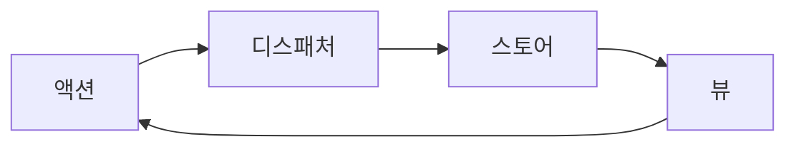

## 리액트가 필요한 이유

- **업데이트**
	- 기존의 업데이트는 **성능**, **신뢰성**, **보안** 의 문제로 인해 대규모 업데이트가 어려웠음
	- 대규모에서 다양한 상태 관리 추적이 어려웠음

### Jquery
- 인기를 잃은 이유
	- **크기 및 로딩 시간**
	- **최신 브라우저와의 중복성**
		- 최신 브라우저에서 다양한 API를 지원하며 굳이 jquery를 사용하지 않아도 되게 됨
	- **성능 고려 사항**
		- 많은 작업을 간소화 하지만 성능을 저하시키는 경우도 많음

### Backbone
Extjs와 아주 유사해 보이기도함
- 브라우저와 자바스크립트 간의 상태 불일치, 코드 재사용, 테스트 가능성 등을 해결하기 위해 등장함
- MVC 패턴
	- 앱을 연결된 세 가지 구성 요소로 나누고, 정보의 내부 표현과 해당 정보가 사용자에게 표시되거나 수용되는 방식을 요소별로 분리하는 디자인 철학
	- Model
		- 데이터와 비즈니스 규칙을 담당
	- View
		- 사용자 인터페이스를 나타냄
	- Controller
		- 모델과 뷰 사이의 인터페이스 역할
- MVC 패턴의 한계
	- 복작한 상호 작용 및 상태 관리
		- 화면에 표시되지 않는 뷰를 제어하는 컨트롤러가 생기기도 하고, MVC 구성 요소 간의 경계가 명확하지 않아서 충돌을 일으키는 경우도 있음
		- 규모가 커지면 컨트롤러가 늘어나면서, 상태 변경과 UI에 대한 영향을 관리하기 어려워짐
		- **리액트가 해결한 방식**
			- 컴포넌트 기반 아키텍쳐와 UI === f(prop) 형태의 함수 구조로 영향을 쉽게 파악할 수 있음
	- 양방향 데이터 바인딩
		- 데이터 소유권 문제가 대충 처리되거나 관심사가 명확하지 않은 경우가 종종 발생
		- **리액트가 해결한 방식**
			- 단방향 데이터 흐름이라는 패턴을 활용
			- 리액트 컴파일러 같은 시스템을 통해 데이터의 우선순위를 정하고 강제하기도 함
			- 예측 가능성을 높이고, 관심사를 더 명확하게 분리할 수 있게 해줌
	- 강한 결합
		- 모델, 뷰, 컨트롤러가 강하게 결합되어 다른 구성 요소에 영향을 주지 않고 독립적으로 수정 혹은 리팩터링하기 어려움 -> 낮은 응집도도 하나의 문제가 되었을거 같음.
		- **리액트가 해결한 방식**
			- 컴포넌트 기반 모델을 통해 더 모듈화 되고 분리된 접근 방식을 장려함. 필요한 구성 요소를 UI 표현과 가까운 곳에 둘 수 있음
- 단점
	- 보일러 플레이트 코드
	- 양방향 데이터 바인딩 부족
	- 이벤트 중심 아키텍처
	- 조합성 부족

### Knockout
옵저버블과 바인딩을 작성하는 방법을 제공하는 최초의 반응형(reactive) 라이브러리 중 하나. 반응형(reactive)란 관찰 가능한 방식으로 상태 변화에 따라 값을 업데이트 한다는 의미. 현대에는 Vue, SolidJS, Svelte, Qwik, Angular 등이 이러한 반응성을 통해 상태를 관리함.

- MVVM 패턴 사용
	- Model
		- 비즈니스 로직
	- View
		- UI
	- View Model
		- 모델과 뷰 사이의 다리 역할
	- **장점**
		- 테스트 가능성
		- 재사용성
		- 유지 보수성
		- 데이터 바인딩
	- MVC와의 차이점
		- 결합과 바인딩
			- MVVM에서 뷰는 뷰 모델에 직접 바인딩됨. 뷰의 변경 사항은 뷰 모델에 자동으로 반영되며 그 반대의 경우도 마찬가지.
			- MVC에서는 컨트롤러를 통해 사용자 입력이 관리되고, 컨트롤러가 모델을 업데이트하고 뷰를 업데이트함
			- 모델과 뷰 사이에 컨트롤러가 없는 경우 데이터 소유권이 더 명확하고 사용자에게 더 가까이 있음
	- 리액트는 단방향 데이터 흐름을 통해 MVVM을 개선함.
	- 데이터 소유권이 **더욱 제한되어** 상태가 필요한 특정 컴포넌트가 상태를 소유함

### AngularJS
- 양방향 데이터 바인딩
	- 모델이 변경되면 뷰도 변경 사항을 반영하도록 자동 업데이트함
	- 그 반대도 마찬가지
- 모듈식 아키텍처
	- 앱의 구성요소를 분리할 수 있도록 모듈식 아키텍처를 도입한 것이 앵귤러임
	- 기능을 캡슐화 하며 독립적으로 개발, 테스트, 유지 관리할 수 있음
- 의존성 주입
	- DI는 객체가 의존성을 직접 만드는 대신 의존성을 전달받는 디자인 패턴
	- 의존성 관리를 간소화 하며 컴포넌트의 테스트 가능성과 재사용성을 향상시킴
- Backbone, Knockout과 비교
	- Backbone은 앵귤러보다 제약이 적었음. 하지만 보일러플레이트가 많이 필요했음
	- 앵귤러는 강한 제약으로 구조화된 개발이 가능함. 이러한 제약은 오히려 개발 속도를 높임
- 트레이드 오프
	- 성능
	- 복잡성
		- 너무 다양한 개념과 기능으로 러닝 커브가 높았고 한 기능 구현을 위해 어떤 기능을 사용할것인지도 명확히 하기 어려웠음
	- 앵귤러 2로의 마이그레이션 문제
		- 앵귤러 2는 1과 호환되지 않았음. 타입스크립트로 코드를 작성해야 했음
	- 복잡한 템플릿 문법
	- 타입 안정성 부재
	- 혼동되는 $scope 모델
	- 제한적인 개발 도구
	- 

## 리액트 등장
- 리액트가 제시한 핵심 아이디어 하나는 컴포넌트 기반 아키텍처
- 리액트는 단방향 데이터 흐름 패턴을 도입해 개발자가 앱을 더 잘 제어하고, 어떻게 변화하는지 더 쉽게 이해할 수 있게 함
- 가상 DOM으로 DOM 조작을 최소화해 성능을 향상함

### 리액트의 핵심 가치
리액트가 제시하는 해결책이란?

- DOM에 대한 선언적 추상화: **우리가 보고자 하는 것**을 코드로 표현하는 방법을 제공하고 실제로 **어떻게 할지는** 리액트가 알아서함
- 우리는 **무엇**을 완료하고 싶은지 기술하면 그 목표를 **어떻게** 이룰지는 리액트가 다룸

#### 가상돔
- 가상 DOM은 실제 DOM을 자바스크립트 객체로 표현하는 개념
- 가상 DOM에서 일어나는 모든 변경은 **재조정** 과정을 통해 실제 DOM에 적용됨
- 이전 가상 DOM 트리와 새 가상 DOM 트리를 비교해 **prop**이 변경되었거나 상태가 변경 되었거나 아니면 둘 다 변경된 것을 갈게됨
- 이를 통해 리액트는 해당 컴포넌트를 '더티(dirty)' 또는 '업데이트가 필요함'으로 표시할 수 있음

#### 컴포넌트 모델
- 리액트는 애플리케이션을 작은 조각으로 나누고 이를 커다란 트리에 추가해 앱을 구성하는 '컴포넌트 단위로 생각하기'를 적극 권장함
	- 컴포넌트를 잘 추상화 해서 재사용하면 수정 범위를 줄일 수 있음
	- 관심사를 분리할 수 있음. 예를들어 RegisterButton 컴포넌트가 있다고 가정하면, Button 컴포넌트로 RegisterButton 컴포넌트를 만들고 RegisterButton 컴포넌트에 비즈니스 로직 처리를 맡길 수 있음. 이런 형태로 여러 컴포넌트를 조합해 사용하는 방식을 **합성**이라고 함
- 컴포넌트 모델이 리액트 성공과 인기의 비결이된 기본 개념임.

#### 불변 상태
- 리액트의 설계 철학은 애플리케이션 상태를 불변하는 값의 집합으로 기술하는 패러다임
- 불변성을 강제해 UI가 특정 시점에 특정 상태를 반영하도록 보장함
- 불변성 덕분에 Replay.io 같은 시간 여행 디버깅을 지원하는 개발자 도구도 사용할 수 있음

### 리액트 출시
- 초기에 JSSX가 크게 비난 받음. 자바스크립트에 HTML을 넣었다며 관심사 분리 원칙을 해쳤다고 비난함. -> 사실 이 부분에서 TailwindCSS 같은 CSS in JS가 생각이남. 오히려 이게 응집도가 높지 않나? 컴포넌트 단위의 개발 멘탈 모델과, 결국 HTML, CSS가 UI와 관련된 로직이라는 점을 고려하면 오히려 솔직히 수정할 파일의 범위를 하나로 통합할 수 있어서 훨씬 편하다고 생각함.
- 리액트 데이터 흐름 관리 패턴은 Flux 패턴임

### 플럭스 아키텍처


#### 액션
- 새 데이터와 액션의 종류를 식별하는 속성을 포함하는 단순한 객체
- 사용자 상호 작용, 서버 응답, 양식 입력 등 시스템에 대한 내외부 입력을 표현
- 션은 중심의 디스패처를 통해 여러 스토어로 보내짐

```js
{
	type: 'ADD_TODO',
	text: '플럭스 아키텍처'
}
```

#### 디스패처
- 플럭스 아키텍처의 중심
- 액션을 받아 등록된 스토어로 보냄
- 모든 스토어는 디스패처에 스토어 자신과 콜백을 등록해둠
- 콜백 목록을 관리하는 것도 디스패처
- 액션을 디스패칭하면 등록된 모든 콜백으로 해당 액션을 전송

```js
Dispatcher.dispatch(action);
```

#### 스토어
- 앱의 상태와 로직을 포함
- MVC 아키텍처와 다소 유사하지만, 스토어는 다수 객체의 상태를 관리
- 스토어 자신을 디스패처에 등록하고 액션을 처리하는 콜백도 제공
- 스토어 상태 업데이트시 변경 이벤트를 발생해 뷰에 변경 사항을 알림

```js
class TodoStore extends EventEmitter {
	constructor() {
		super();
		this.todos = [];
	}
	
	handleActions(action) {
		switch (action.type) {
			case "ADD_TODO":
				this.todos.push(actions.text);
				this.emit("change");
				break;
			default:
			// 아무 동작 없음
		}
	}
}
```

#### 뷰
- 리액트 컴포넌트
- 스토어에서 변경 이벤트를 받으며, 의존하는 데이터가 변경되면 스스로 업데이트
- 시스템 상태를 업데이트하는 새로운 액션을 생성해 단방향 흐름을 시작하기도 함