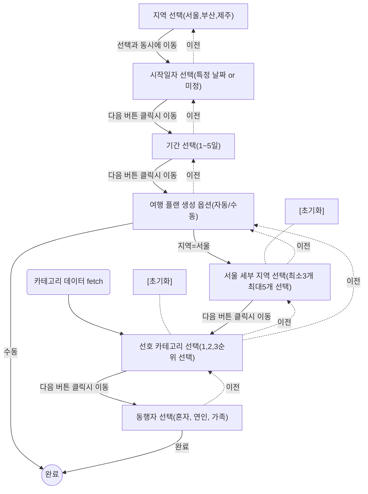

# 여행 플래너 프론트엔드 상세 구현 요구사항

  

## 1. 전체 개요

  

- 여러 단계의 설문을 통해 사용자의 여행 선호 정보를 수집하고 여행 일정을 생성하는 프로세스를 구현합니다.

- 생성된 여행 일정을 조회할 수 있습니다.

- (선택 과제) 생성된 여행 일정의 정보를 수정할 수 있습니다.

  

## 2. 여행 일정 생성 단계

  

  

### 다음 / 이전 / 리셋 / 완료 버튼의 동작

  

각 단계의 버튼 이벤트는 다음과 같은 규칙을 따릅니다.

  

1. 지역 선택: 지역 선택과 동시에 다음 단계로 이동합니다.

2. 날짜 선택: 날짜 선택 혹은 미정 옵션 선택시 다음 단계로 이동 버튼이 활성화됩니다.

3. 기간 선택: 기간 옵션 선택시 다음 단계로 이동 버튼이 활성화됩니다.

4. 생성 옵션 선택: 생성 옵션 선택시 다음 단계로 이동 버튼이 활성화됩니다.

5. 세부지역 선택: 유효한 세부지역 갯수(3~5개) 선택시 다음 단계로 이동 버튼이 활성화됩니다.

6. 카테고리 선택: [API(GET /api/categories)](./app/api/categories/route.ts)를 통해 카테고리 목록을 가져온 후, 사용자가 선호 카테고리의 1,2,3 순위 선택 완료시 다음 단계로 이동 버튼이 활성화됩니다. 데이터 로딩 중에는 로딩 상태를 표시합니다.

7. 동행자 선택: 동행자 선택과 동시에 완료 버튼이 활성화됩니다.

8. 완료 버튼: 완료 버튼 클릭시 [API(POST /api/itineraries)](./app/api/itineraries/route.ts)를 통해 여행 일정을 생성합니다.

  

모든 단계의 이전 버튼 이벤트는 **해당 단계의 선택값을 초기화**하고 이전 단계로 이동하는 것을 원칙으로 합니다.

  

다중 선택이 존재하는 **세부 지역 선택**, **카테고리 선택** 단계는 초기화 가능한 내용이 있을 경우 초기화 버튼이 활성화됩니다. 초기화 버튼 클릭시 **다중 선택 내역만 초기화**하고 단계는 유지됩니다.

  

### UI/UX 세부 가이드

  

1. **진행 표시 (Progress)**

- [Progress](./components/ui/progress.tsx) 컴포넌트를 사용하여 현재 단계의 진행내역을 상단에 고정 노출합니다.

2. **에러/유효성**

- [Calendar](./components/ui/calendar.tsx)에서 과거 날짜 선택이 불가능합니다.

- 모든 ‘다음’,'초기화' 버튼은 조건 불충족 시 disabled 상태가 됩니다.

3. **접근성**

- 모든 동작은 키보드를 통한 조작이 가능하도록 접근성이 지원되어야 합니다.

- 키보드 탭 순서가 올바르게 보장되어야 합니다.

4. **저장**

- 여행 일정의 영속성 보장은 과제 범위 밖입니다.

  

## 3. 테스트 시나리오

  

### 여행 일정 생성

  

1. **정상 플로우(서울)**

- 메인지역=서울, 생성 옵션=자동 → 세부지역 UI 노출 → 완료.

2. **정상 플로우(제주)**

- 메인지역=제주, 생성 옵션=자동 → 세부지역 스킵 → 완료.

3. **뒤로가기 시 데이터 초기화 확인**

- 서비스요소 선택 후 뒤로 버튼 클릭 → 선택값 초기화되어야 함.

4. **다중 선택 토글**

- 같은 항목 두 번 클릭 시 선택 해제되어야 함.

5. **Disabled 조건**

- 필수값 미선택 상태에서 ‘다음’ 버튼 클릭 불가 확인.

  

### 여행 일정 조회

  

**정상 플로우(생성 직후)**

  

- 여행 일정 생성 후 조회 → 여행 일정 조회 화면 노출.

  

### (선택 과제) 여행 일정 수정

  

1. **정상 플로우(상세 조회)**

- 여행 일정 조회 화면에서 생성된 여행 일정 클릭 → 여행 일정 수정 화면 노출.

2. **정상 플로우(수정 후 조회)**

- 여행 일정 수정 화면에서 여행 일정 제목, 여행 일정 내 장소 추가/삭제 완료 → 수정된 여행 일정 노출.
